<div align="center">

# NL Voice Skills

**Next Level Voice Skills** · A field guide for building better voice agents.

[Start here](#start-here) · [Handbook](docs/handbook.md) · [Skill library](docs/catalog.md) · [Use a skill](#use-a-skill)

</div>



Practical guides, reusable agent skills, and original-source resources for the
parts of voice AI that are easy to underestimate: pauses, echo, corrections,
unfinished actions, and calls that need to recover.

**9 original foundations** · **27 provider snapshots** · **102 additional skill links** · **43 runtime resources**

## Start here

| You're here to… | Take this route |
| :--- | :--- |
| **Build something new** | [Choose an architecture](skills/foundations/voice-stack-selection/references/architecture-guide.md) → [plan the conversation](skills/foundations/voice-conversation-design/SKILL.md) → [test the whole call](skills/foundations/voice-agent-evaluation/SKILL.md) |
| **Fix a rough conversation** | [Find your symptom below](#what-does-the-caller-notice) → open the focused guide → use its skill on your project |
| **Equip a coding agent** | [Pick a foundation or provider skill](docs/catalog.md) → [install the complete folder](docs/usage.md) |

## Use a skill

```sh
git clone https://github.com/RBStrayer/nl-voice-skills.git
```

Choose a folder containing `SKILL.md`. Install that **whole folder**, including
its references and assets, using your agent host's supported method.
For provider skills, follow the **original upstream installation instructions**.

Then give your agent a concrete job:

> Use **voice-turn-taking** to investigate callers being cut off during pauses.
> Identify the turn owner, inspect interruption handling, and propose test cases
> before changing thresholds.

[Installation and compatibility →](docs/usage.md) · [Browse all bundled skills →](docs/catalog.md)

## Choose the shape of the conversation


[Open the comparison at full size](skills/foundations/voice-stack-selection/assets/speech-architectures.svg)

<details>
<summary>Read the three paths as text</summary>

- **Chained:** speech recognition → text agent → speech synthesis. Inspect or transform text between stages.
- **Speech to speech:** one voice session handles audio interpretation, reasoning, tools, and speech.
- **Delegated:** a spoken interface sends work to a separate backend and uses the returned results.

</details>

The speech path is one decision. You still need owners for media, turn control,
business actions, hosting, and recovery.

**[Work through the architecture guide →](skills/foundations/voice-stack-selection/references/architecture-guide.md)**
Includes tradeoffs, a worked appointment-system comparison, and a decision worksheet.

## What does the caller notice?

| The experience | Start investigating |
| :--- | :--- |
| “It cuts me off.” | [Turn taking and interruptions](skills/foundations/voice-turn-taking/references/turn-taking-guide.md) |
| “It hears itself, or loses my quiet words.” | [Noise, echo, and capture](skills/foundations/voice-audio-frontends/references/audio-frontends-guide.md) |
| “It gets the name wrong, then says it strangely.” | [Recognition, pronunciation, and playback](skills/foundations/voice-speech-pipeline/references/speech-pipeline-guide.md) |
| “I corrected it. Did it still book the old time?” | [Interrupted actions and reconciliation](skills/foundations/voice-conversation-design/references/transactions-and-handoffs.md) |
| “The transfer failed and I got stuck.” | [Telephony and recoverable handoffs](skills/foundations/voice-call-reliability/references/telephony-guide.md) |
| “It takes forever, or goes silent.” | [Latency](skills/foundations/voice-latency-audit/SKILL.md) · [Media debugging](skills/foundations/voice-media-debugging/SKILL.md) |

**[Open the engineering handbook →](docs/handbook.md)**
All eleven work areas, grouped into design, conversation, actions, and operations.

## Explore the library

| Skills for your coding agent | Guides and runtime resources |
| :--- | :--- |
| [**Core collection**](docs/catalog.md): foundations and dated provider copies | [**Runtime resources**](docs/resources.md): frameworks, speech models, media, and evaluation |
| [**More upstream skills**](docs/more-skills.md): 102 direct links across 20 original repositories | [**Engineering handbook**](docs/handbook.md): diagrams, worked cases, and test worksheets |

Original provider collections:
[LiveKit](https://github.com/livekit/agent-skills) ·
[Pipecat](https://github.com/pipecat-ai/skills) ·
[ElevenLabs](https://github.com/elevenlabs/skills) ·
[Twilio](https://github.com/twilio/ai) ·
[Cartesia](https://github.com/cartesia-ai/skills) ·
[OpenAI](https://github.com/openai/skills)

---

**Source review: September 30, 2026 (UTC).** Original links follow maintained
sources; bundled copies are dated snapshots. Counts describe files and projects,
not a quality ranking. [Review notes and Context7 coverage](docs/documentation-review.md).

<details>
<summary>How this collection stays current</summary>

Daily maintenance checks original sources and releases, validates supported
updates, and pushes to this private repository. The scheduler and credentials
live outside the checkout. [Maintenance procedure](docs/maintenance.md).

Validation covers source hashes, licenses, skill structure, links, and common
credential patterns. Voice quality still needs testing on the application's
real audio path. [Research scope](docs/research.md).

</details>

[Contribute](CONTRIBUTING.md) · [Original material: MIT](LICENSE) ·
[Third-party notices](THIRD_PARTY_NOTICES.md) · [Figure sources](docs/diagram-style.md)

Maintained by [Rob Strayer](https://github.com/RBStrayer).
