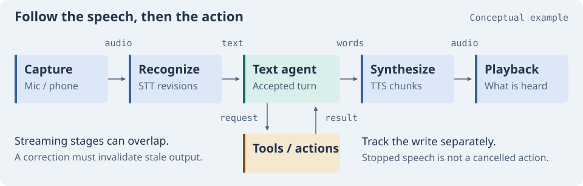
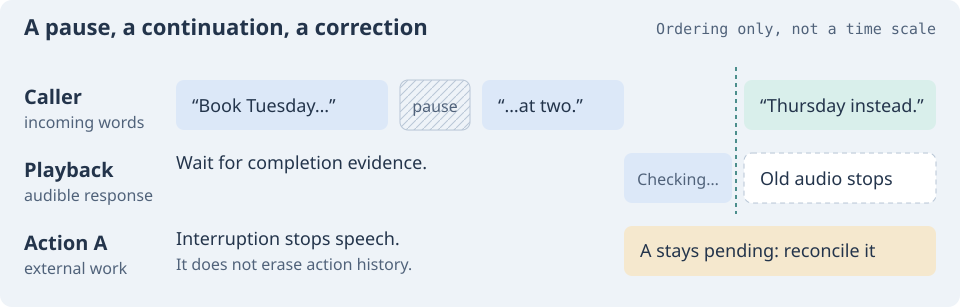
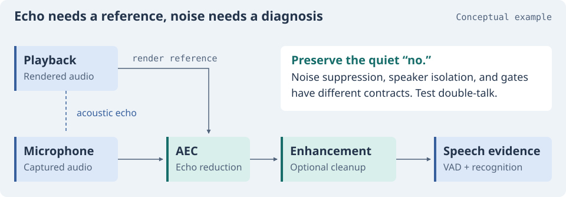
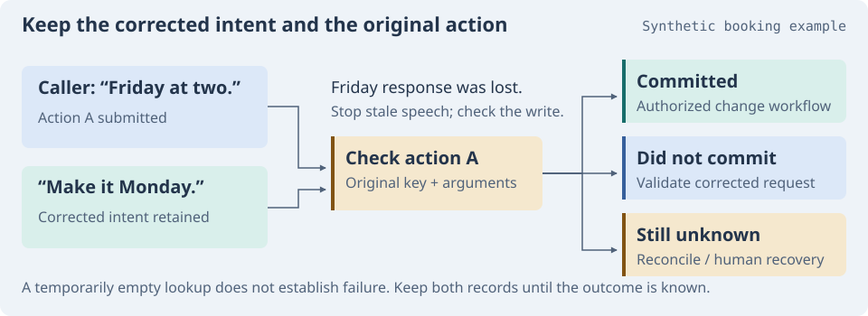
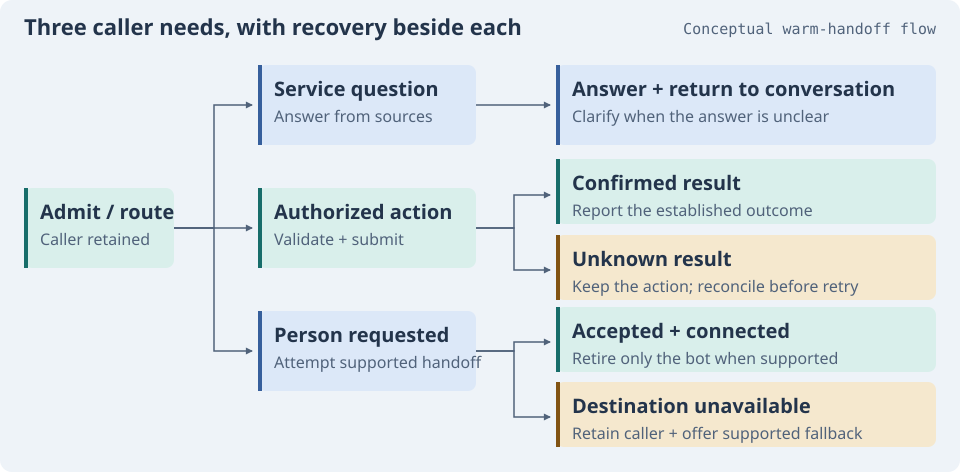
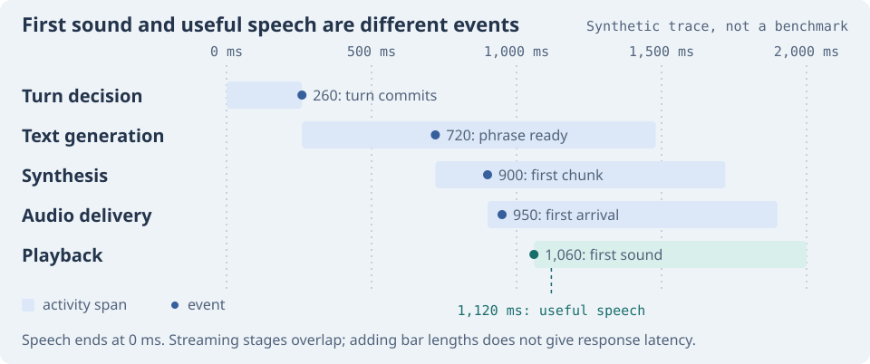

# Next Level Voice Skills

Skills, diagrams, and practical guides for people building voice AI agents.

[Browse all skills](docs/catalog.md) · [More upstream skills](docs/more-skills.md) · [Engineering handbook](docs/handbook.md) · [Installation](docs/usage.md)

Use this collection to learn a part of the voice stack, find instructions for
your coding agent, or work through a difficult call. The nine original foundation
skills cover engineering problems across providers. Provider collections link
those ideas to implementation workflows and their original, maintained sources.

**9 foundation skills · 27 provider snapshots · 102 additional skill links · 43 runtime resources**

**Reviewed September 30, 2026 (UTC).** Provider copies are dated snapshots. Original
source links lead to maintained repositories. Review dates describe when sources
were checked, not when their authors last changed them.

## Find a skill for the job

Each foundation folder includes `SKILL.md` and supporting references. Open a skill
to see when to use it, what evidence to collect, and how to check the result.

| What you're working on | Start with |
| :--- | :--- |
| Choosing a speech architecture, transport, or runtime | [Stack selection](skills/foundations/voice-stack-selection/SKILL.md) |
| Early answers, awkward pauses, or failed interruptions | [Turn taking](skills/foundations/voice-turn-taking/SKILL.md) |
| Echo, background noise, or quiet words disappearing | [Audio frontends](skills/foundations/voice-audio-frontends/SKILL.md) |
| Transcript revisions, pronunciation, or streaming speech | [Speech pipeline](skills/foundations/voice-speech-pipeline/SKILL.md) |
| Questions, corrections, and actions that outlive speech | [Conversation design](skills/foundations/voice-conversation-design/SKILL.md) |
| Phone legs, human transfers, or worker failures | [Call reliability](skills/foundations/voice-call-reliability/SKILL.md) |
| Finding where a slow response spent its time | [Latency audit](skills/foundations/voice-latency-audit/SKILL.md) |
| Silent audio, codec errors, or playback queues | [Media debugging](skills/foundations/voice-media-debugging/SKILL.md) |
| Repeatable tests for calls, tools, and recovery | [Agent evaluation](skills/foundations/voice-agent-evaluation/SKILL.md) |

Looking for a specific platform? The [provider catalog](docs/catalog.md) groups
the bundled collections. The [expanded index](docs/more-skills.md) links directly
to additional skills from their original authors. For a framework, speech model,
or audio utility, use the [runtime resource library](docs/resources.md).

## Learn your way through the stack

The walkthrough below follows a conversation from capture to playback, then
through actions, phone routing, and testing. Each part includes relevant skills
and a deeper guide. You can read it in order or jump to the problem you're solving.

[Architecture](#choose-the-system-you-can-explain) · [Turn taking](#give-the-caller-room-to-finish) · [Audio](#keep-the-words-lose-the-interference) · [Recognition and speech](#carry-the-meaning-through-recognition-and-speech) · [Actions](#when-the-caller-changes-their-mind) · [Calls](#make-calls-and-handoffs-recoverable) · [Timings and tests](#measure-the-conversation-the-caller-received)

## Choose the system you can explain

Before comparing models, write down what the agent must accomplish. Answering
questions, collecting an address, and changing a reservation have different
failure costs. Include the channel, languages, expected noise, human escalation,
existing tools, operating team, and budget. Leave unknowns visible.

Then draw the responsibilities: who carries audio, decides whose turn it is,
executes an action, and recovers an interrupted session? A speech model choice
answers only part of that design.



[View this diagram at full size](assets/atlas-cascade.svg)

### Three speech paths worth comparing

| Starting point | Why you might choose it | What to prove |
| :--- | :--- | :--- |
| **Speech-to-text → text agent → text-to-speech** | You need intermediate text, an existing text workflow, or separate speech components. | Transcript revisions, phrase buffering, and cancellation behave correctly across stages. |
| **Speech-to-speech session** | You want the model to interpret and produce audio within the conversation. | The chosen session provides the controls, languages, tool behavior, and evidence your application needs. |
| **Spoken interface with delegated backend work** | You want to retain an existing workflow behind the voice interaction. | Delegation, progress, returned results, and failure recovery preserve the right state. |

These are conceptual boundaries. The [current OpenAI voice guide](https://developers.openai.com/api/docs/guides/voice-agents)
describes all three paths. No path guarantees the lowest caller-perceived delay;
endpointing, streaming, network placement, and playback still affect the result.

Hosting is another decision. A chain can run in a managed runtime, and an
application you operate can call a hosted speech model. Decide whether your team
can support admission, capacity, dispatch, and deployments while calls remain
active. Check the full processing route before promising a region or retention policy.

### A booking system makes the tradeoffs concrete

Suppose you already have a booking service and need web and inbound phone access.
The business requires validated values before a write, callers need human
escalation, and the team is small. This is a design exercise, not a tested stack
recommendation.

A chain is a useful candidate if you also need a text checkpoint before every
spoken response or want to retain an existing text agent. A native speech session
remains a candidate when validated tool arguments satisfy the business checkpoint.
An action check alone does not force the entire conversation through a text chain.

Both candidates still need an authorized booking service, a way to establish
uncertain outcomes, and a tested transfer route. Compare them using the same
corrections, noisy input, and failed writes. Record caller-audible timing and total
cost with the same boundaries. Choose a default and name the requirement that
would make you reconsider it.

> **Keep generated speech, delivered speech, and committed actions separate.**
> The model may finish an answer that the caller never hears. A booking may finish
> after its confirmation was interrupted. Each needs its own evidence.

The [architecture guide](skills/foundations/voice-stack-selection/references/architecture-guide.md)
includes transport choices, capacity, billing boundaries, and a worked worksheet.

Skills for this decision:

- [Stack selection](skills/foundations/voice-stack-selection/SKILL.md): compare complete candidates and write the decision record.
- [Twilio agent architect](https://github.com/twilio/ai/blob/main/skills/twilio/twilio-ai-agent-architect/SKILL.md): choose a Twilio voice implementation path.
- [Build a LiveKit agent](https://github.com/livekit/agent-skills/blob/main/skills/building-livekit-agents/SKILL.md): implement sessions, tools, and workflows.
- [Initialize Pipecat](https://github.com/pipecat-ai/skills/blob/main/skills/init/SKILL.md): turn the chosen pipeline into a project; check the [current CLI notes](docs/usage.md#pipecat-cli-installation).

## Give the caller room to finish

“Send it to Alex… actually, to Alexis.” A quiet stretch between those phrases
doesn't tell you whether the thought is complete. Voice activity detection finds
likely speech. Silence endpointing waits for a gap. End-of-turn prediction estimates
completion. A finalized transcription segment follows its recognizer's contract.
Your application still needs to decide when to respond.



[View this diagram at full size](assets/atlas/conversation-score.svg)

Give one controller authority to commit a user turn and release the response.
Other detectors contribute evidence. Otherwise, two policies can trigger two
answers or add their waiting periods together.

An “uh-huh” can invite the agent to continue. A quiet “no” can reverse the answer
to a confirmation question. Raising duration or word-count thresholds may suppress
both. Test short corrections, spelled names, numbers, code switching, and callers
who need more time to formulate a response.

When an interruption is accepted, follow it through the system:

1. Invalidate the old response and cancel obsolete generation where supported.
2. Stop active playback and clear its queued audio.
3. Reject late chunks belonging to that response.
4. Reconcile conversation history with playback evidence.
5. Keep any external action under its own cancellation or recovery contract.

A stopped generator can leave seconds of audio in another buffer. A stopped
coroutine cannot establish that a remote write stopped. Check every boundary
your actual transport exposes.

The [turn-taking guide](skills/foundations/voice-turn-taking/references/turn-taking-guide.md)
includes detector requirements and a correction-during-booking trace.

- [Turn taking](skills/foundations/voice-turn-taking/SKILL.md): find early endpoints, false interruptions, and competing response triggers.
- [Conversation design](skills/foundations/voice-conversation-design/SKILL.md): write questions and repairs that leave room for the caller.
- [Debug LiveKit agents](https://github.com/livekit/agent-skills/blob/main/skills/debugging-livekit-agents/SKILL.md): exercise a multi-turn conversation and inspect behavior.
- [Deepgram conversational STT, JavaScript](https://github.com/deepgram/deepgram-js-sdk/blob/main/.agents/skills/deepgram-js-conversational-stt/SKILL.md): integrate the conversational recognition path using its own event contract.

## Keep the words, lose the interference

Noise cancellation deserves its own design. An agent hearing its speaker,
a fan keeping speech detection active, and a nearby person issuing an apparent
command are different problems.

**Acoustic echo cancellation** reduces playback leaking into capture. Conventional
AEC needs a reference to the rendered audio, with usable timing. **Noise suppression**
attenuates interference. **Speaker isolation** favors a selected or primary speaker.
A **noise gate** changes level below a threshold and can remove quiet syllables.
Gain control cannot recover a word that an earlier processor deleted.



[View this diagram at full size](assets/atlas/audio-cutaway.svg)

Place processing where its inputs exist. A browser capture path may see both the
microphone and playback; a remote agent server usually receives audio after device
processing. The server does not automatically have the caller endpoint's echo
reference. Telephone capture adds carrier and codec boundaries to inspect.

For a laptop that interrupts itself, compare headphones with speaker playback and
inspect capture processing first. If whispered corrections disappear after adding
enhancement, bypass that added stage using the same input. Check clipping and
format conversion before changing gain or turn thresholds.

Keep double-talk in the test set: the agent speaks while the caller says “wait,
change that.” Removing both voices can look like excellent echo reduction while
making interruption impossible. Compare retained words and intended interruptions,
alongside residual noise and added delay.

The [audio guide](skills/foundations/voice-audio-frontends/references/audio-frontends-guide.md)
covers AEC references, browser constraints, resampling, deployment choices, and
speech-preservation measures.

- [Audio frontends](skills/foundations/voice-audio-frontends/SKILL.md): locate the interference and compare processing without losing speech.
- [Media debugging](skills/foundations/voice-media-debugging/SKILL.md): inspect format conversion, capture, and playback boundaries.
- [ElevenLabs voice isolation](https://github.com/elevenlabs/skills/blob/main/voice-isolator/SKILL.md): use the provider's isolation workflow. Check its input and processing contract before considering a live audio path; an isolation skill does not establish streaming AEC support.

## Carry the meaning through recognition and speech

In a cascade, speech-to-text (STT) produces words, the text agent reasons about
them, and text-to-speech (TTS) produces audio. The arrows also carry assumptions:
whether a transcript can still change, when a phrase is ready, and who owns a
cancelled response. This separation lets you inspect intermediate results and
choose components independently. Replacing one component still requires testing
the neighboring event and media contracts.

### Protect the words that change the outcome

Recognition quality is task-specific. A broad word-error score can hide the wrong
booking day, a missing negation, or a nearly correct street name. Build fixtures
from the words that change the outcome, using the microphone or phone channel the
caller will actually use.

### Handle transcript revisions

Treat streaming transcripts as revisions. Replace provisional hypotheses under
the provider's segment or timestamp contract; appending every update duplicates
words. Keep stable segments together until the application's turn policy accepts
the utterance. Reversible preparation can start earlier if corrected intent
invalidates its results.

For example, an application might receive this synthetic sequence. These are
illustrative records, not a provider's event schema:

```text
Segment 7, revision 1, interim: "Tuesday at two"
Segment 7, revision 2, final:   "Thursday at two"
Turn state: waiting for completion evidence
```

Replace the first hypothesis with the second. Preserve the distinction between
a finalized segment and the application's decision to commit the turn.

### Form phrases for playback

Speech generation needs an equally explicit contract. Streaming audio output and
streaming text input are separate capabilities. Decide who forms phrases, flushes
the final short phrase, and bounds output queues. A quick first byte provides
little benefit if the player waits for the entire answer.

Test pronunciation on names, dates, amounts, abbreviations, and identifiers.
Keep the authoritative value separate from its spoken form: changing how a date
is read should not change the date stored by the business service. Listen through
the final transport with the selected voice and language.

The [speech pipeline guide](skills/foundations/voice-speech-pipeline/references/speech-pipeline-guide.md)
covers transcript finality, pronunciation dictionaries, buffering, and component
replacement tests.

- [Speech pipeline](skills/foundations/voice-speech-pipeline/SKILL.md): specify the whole recognition-to-playback contract.
- [Deepgram STT, Python](https://github.com/deepgram/deepgram-python-sdk/blob/main/.agents/skills/deepgram-python-speech-to-text/SKILL.md): integrate recognition in a Python application.
- [ElevenLabs text-to-speech](https://github.com/elevenlabs/skills/blob/main/text-to-speech/SKILL.md): work with speech generation, streaming, and voice settings.
- [Cartesia API](https://github.com/cartesia-ai/skills/blob/main/skills/cartesia-api/SKILL.md): integrate speech APIs and their streaming interfaces.

## When the caller changes their mind

Consider this synthetic case. The caller authorizes Friday at two. The booking
service commits the request, but its response is lost. While the agent is speaking,
the caller says, “Actually, make it Monday.”



[View this diagram at full size](assets/atlas/action-reconciliation.svg)

Stopping the old speech is useful. The application must also discover what happened
to Friday. Keep the original action, arguments, and supported idempotency key;
retain Monday as corrected intent. A temporarily empty lookup does not prove the
first request failed.

- **Friday committed:** use the service's authorized change or cancellation workflow.
- **Friday did not commit:** validate and submit the corrected request with its own action identity.
- **Friday remains unknown:** preserve both records and use the defined reconciliation or human recovery path.

This gives the agent something honest to say: “I'm checking whether Friday went
through before I change it.” A new turn does not justify a second booking.
Application deduplication also cannot manufacture exactly-once effects in an
external API that lacks the necessary contract.

Conversation design includes these recovery sentences, narrow clarification
questions, meaningful progress, and alternatives for people who cannot use the
speech flow comfortably. Keep prompts tied to actual tool state. “Almost done”
requires evidence that the work is nearly complete.

The [transactions guide](skills/foundations/voice-conversation-design/references/transactions-and-handoffs.md)
develops durable action states and recovery across handoffs.

- [Conversation design](skills/foundations/voice-conversation-design/SKILL.md): connect prompts, corrections, and progress to actual application state.
- [ElevenLabs agents](https://github.com/elevenlabs/skills/blob/main/agents/SKILL.md): configure agents, tools, and procedures in that platform.
- [Build LiveKit workflows](https://github.com/livekit/agent-skills/blob/main/skills/building-livekit-agents/SKILL.md): implement tools and handoffs while retaining application action ownership.

## Make calls and handoffs recoverable

A phone call has a control path and a media path. An answered call can still have
one-way audio, a bad codec, or an empty playback queue. Inspect both directions
and record the actual format at each boundary. Build inbound and outbound flows
independently; one working direction does not establish the other.

For a warm handoff, retain the caller while reaching the destination, verify
acceptance, and connect the parties before retiring the bot when the selected
mechanism permits it. Decide who speaks during each transition. Ringing or an
acknowledged transfer request does not establish that a person accepted the caller.

When the destination fails, the caller needs a supported next step: return to the
agent, a bounded wait, contact instructions, or an authorized callback. Confirm
which legs and controls remain available under the chosen carrier's contract.

### Draw a call tree before writing the happy path



[View this diagram at full size](assets/atlas-call-tree.svg)

For an appointment service, begin with what the caller needs: a service question,
a booking, or a person. A question can return to the conversation after an answer.
A booking follows the validation and action checks above. A request for a person
enters a handoff route with an explicit unavailable-destination branch.

Now walk each branch as a caller. What happens when the answer is unclear, the
booking result is unknown, or nobody accepts the transfer? Add a repair or recovery
route beside that decision. Keep the current owner of the caller and any pending
action visible. A final box labeled “done” needs evidence that its promised
outcome happened.

This tree is a design exercise, not a required IVR menu or provider API recipe.
Natural speech can select the route. The tree helps you check that every route
has a useful response and an exit, including a deliberate end to the call.

Production adds another set of caller-visible decisions. Define what happens when
capacity is full, a worker drains during deployment, or a speech service fails.
Track active sessions separately from start rate. Preserve pending action records
through worker loss. Include extra transfer legs and idle capacity when comparing
costs.

The [telephony guide](skills/foundations/voice-call-reliability/references/telephony-guide.md)
and [operations guide](skills/foundations/voice-call-reliability/references/production-operations-guide.md)
cover event authentication, duplicate delivery, draining, overload, and incident recovery.

- [Call reliability](skills/foundations/voice-call-reliability/SKILL.md): trace every leg, transfer, worker, and pending outcome.
- [Twilio TwiML](https://github.com/twilio/ai/blob/main/skills/twilio/twilio-voice-twiml/SKILL.md): define voice and IVR call flows.
- [Twilio conferences](https://github.com/twilio/ai/blob/main/skills/twilio/twilio-conference-calls/SKILL.md): build conferences, holds, and transfer workflows.
- [Telnyx voice, Python](https://github.com/team-telnyx/ai/blob/main/skills/telnyx-voice-python/SKILL.md): implement inbound, outbound, transfer, and bridge operations.
- [Operate LiveKit agents](https://github.com/livekit/agent-skills/blob/main/skills/operating-livekit-agents/SKILL.md): deploy, configure, and roll back workers.

## Measure the conversation the caller received



[View this diagram at full size](assets/atlas-latency.svg)

**Synthetic trace, not a benchmark or target.** On one assumed shared clock:
speech ends at 0 ms; turn commit is 260 ms; the first speakable phrase is ready at
720 ms; the first synthesis chunk at 900 ms; its arrival at 950 ms; the first
playback sound at 1,060 ms; useful speech at 1,120 ms. The latter two are deliberately
different: hearing something is not necessarily hearing a useful answer.

### Read one turn from left to right

Begin at the end of the caller's speech, using a defined audio boundary. The turn
controller may still be waiting for completion evidence. Its **turn commit** says
that the application accepted the turn and can release a response. The gap between
those points includes the waiting policy; a faster text model cannot remove it.

In a chain, **first text** marks when the agent starts producing output. That text
may be too short to speak naturally, so a phrase buffer waits for a usable unit.
The chart marks that speakable phrase, not the first token.
The **first synthesis chunk** marks generated audio reaching the next boundary.
It can still need decoding, transport, and player buffering before **playback**
begins. Define which of those events the log actually captures.

The **first useful audible response** is the caller-facing endpoint. A filler
such as “one moment” is different from the requested answer. A server log cannot
establish what reached the caller's ear without the corresponding evidence.
Report runtime playback when that is all you observed, and keep missing coverage
visible.

These stages can overlap. Recognition can run while the caller speaks; later
text and synthesis can continue while an earlier phrase plays. Read the chart
as one causally ordered trace, not a row of independent durations to add. A
speech-to-speech session may not expose the same internal text and synthesis
boundaries, so preserve what its actual API provides.

The illustration is synthetic, with no vendor benchmark or universal timing
target implied. On real calls, correlate session, turn, response, and action IDs,
and align clock domains before subtracting timestamps. Compute the distribution
from comparable end-to-end turn measurements. Adding each component's p95 does
not produce end-to-end p95. Keep interruption-to-stop delay as another measure,
including residual queued speech, rather than folding it into answer latency.

For a timing investigation:

- [Latency audit](skills/foundations/voice-latency-audit/SKILL.md): reconstruct a turn from raw events and state measurement coverage.
- [Media debugging](skills/foundations/voice-media-debugging/SKILL.md): locate transport, decoder, and playback queues.
- [LiveKit debugging](https://github.com/livekit/agent-skills/blob/main/skills/debugging-livekit-agents/SKILL.md): reproduce the conversation that exposes the delay.
- [ElevenLabs TTS](https://github.com/elevenlabs/skills/blob/main/text-to-speech/SKILL.md): inspect the synthesis integration and its streaming settings.

### Give each failure a repeatable test

When audio is silent, distorted, or late, follow samples and events from capture
to playback. Inspect codec, sample rate, channels, framing, conversion, and queue
ownership. Relabeling samples changes their interpreted duration; upsampling
telephone audio does not restore missing frequencies.

Build a release set around successful tasks and difficult transitions: pauses,
quiet corrections, interruptions during writes, failed transfers, cold starts,
disconnects, and cleanup. Text simulations help with dialogue and tool logic.
Audio and transport tests establish different evidence. Verify the resulting
business records as well as what the agent said.

- [Agent evaluation](skills/foundations/voice-agent-evaluation/SKILL.md): build a proportionate test matrix and record what remains unproven.
- [Test LiveKit agents](https://github.com/livekit/agent-skills/blob/main/skills/testing-livekit-agents/SKILL.md): write turn-level behavior regressions.
- [Write LiveKit scenarios](https://github.com/livekit/agent-skills/blob/main/skills/writing-livekit-scenarios/SKILL.md): preserve meaningful caller situations as simulation scenarios.
- [Run LiveKit simulations](https://github.com/livekit/agent-skills/blob/main/skills/running-livekit-simulations/SKILL.md): exercise those scenarios within the authorized test scope and inspect outcomes.

## Put the skills to work

```sh
git clone https://github.com/RBStrayer/nl-voice-skills.git
cd nl-voice-skills
```

Choose a folder containing `SKILL.md`. Install that **whole folder**, including
references and assets, using your agent host's supported method. Follow original
upstream installation instructions for current provider skills; bundled provider
copies are reference snapshots. The collection supplies instructions, not provider
credentials or every host's runtime tools.

Give the agent a bounded task and the evidence it needs:

> Use voice-turn-taking and voice-audio-frontends on this project. Callers are
> cut off during pauses, and the agent sometimes hears its own speaker. Map the
> capture processing and turn owner, inspect the supplied redacted traces, and
> propose separate regression fixtures before changing thresholds.

[Installation and compatibility](docs/usage.md) · [All foundation and provider skills](docs/catalog.md)

### Six original provider collections

| Collection | Skills available here |
| :--- | :--- |
| [**LiveKit**](https://github.com/livekit/agent-skills) | Build, debug, test, simulate, operate, and retrieve current documentation. |
| [**Pipecat**](https://github.com/pipecat-ai/skills) | Initialize and deploy projects; talk to agents through the supported MCP workflow. |
| [**ElevenLabs**](https://github.com/elevenlabs/skills) | Conversational agents, recognition, synthesis, dubbing, voice conversion, and isolation. |
| [**Twilio**](https://github.com/twilio/ai) | Voice architecture, ConversationRelay, TwiML, outbound calls, conferences, and recordings. |
| [**Cartesia**](https://github.com/cartesia-ai/skills) | Speech API integration and Line agent workflows. |
| [**OpenAI**](https://github.com/openai/skills) | File-oriented speech generation and transcription. These bundled skills are not a realtime agent runtime. |

The [expanded index](docs/more-skills.md) adds original skills for Telnyx, Vapi,
Deepgram, AssemblyAI, cloud speech, evaluation, and local audio. Language variants
count as separate files; counts are not independent capability or quality scores.

For runtime components, explore the [resource library](docs/resources.md):
frameworks such as LiveKit Agents and Pipecat, turn tools such as Silero VAD and
Smart Turn, speech models, media utilities, and evaluation projects. Repository
stars are dated adoption signals. Code licenses can differ from model, voice,
data, and hosted-service terms; the library retains those qualifications.

## Sources, updates, and further reading

The [engineering handbook](docs/handbook.md) provides longer paths through all
eleven work areas. Each guide keeps its sources and review date beside the
technical material. The [documentation review](docs/documentation-review.md)
records Context7 coverage, direct primary-source checks, and gaps. A review is
not a benchmark or a compatibility guarantee for every SDK and transport.

Daily maintenance checks upstream changes and releases using the
[maintenance procedure](docs/maintenance.md). Bundled copies have explicit
provenance; they do not silently become the newest upstream revision. Source,
license, structure, link, and common credential-pattern checks protect the
collection. Test voice quality on your application's actual audio path.

[Contribute](CONTRIBUTING.md) · [Original material: MIT](LICENSE) ·
[Third-party notices](THIRD_PARTY_NOTICES.md) · [Research scope](docs/research.md) ·
[Diagram sources](docs/diagram-style.md)

Maintained by [Rob Strayer](https://github.com/RBStrayer).
