# Build the conversation, end to end

[Home](../README.md) / Engineering handbook

Follow a call from the first sound at the microphone to a confirmed result.
Each chapter explains the problem, works through an example or a decision, and
gives you checks to run on a real project.

**[01 Design](#01-design-the-system)** · **[02 Listen and respond](#02-listen-and-respond)** ·
**[03 Act and connect](#03-act-and-connect)** · **[04 Operate and verify](#04-operate-and-verify)**

Source review dates and version qualifications live in each guide.
**Guide** links teach the topic; **Skill** links give a coding agent its working instructions.
New to voice agents? Read [getting started](getting-started.md) first. For one call
followed end to end, read [how a voice call really works](walkthrough.md).

## 01 Design the system

**Start with responsibilities.** Decide who owns the audio, the turn, the action,
and the recovery before committing to a provider.

| Work area | What you'll work through | Open |
| :--- | :--- | :--- |
| **Architecture** | Speech paths, hosting, transport, capacity, cost, and a worked appointment-system decision | [Guide](../skills/foundations/voice-stack-selection/references/architecture-guide.md) · [Skill](../skills/foundations/voice-stack-selection/SKILL.md) |
| **Conversation and accessibility** | Useful questions, narrow repairs, confirmations, and supported alternatives to speech | [Skill and checklist](../skills/foundations/voice-conversation-design/SKILL.md) |
| **Cost** | Per-minute cost from phone, speech, model and server prices, with stress cases | [Skill and estimator](../skills/foundations/voice-cost-estimation/SKILL.md) |

**Leave with:** a stack choice, who owns each part, and what would make you change
your mind.

## 02 Listen and respond

**Preserve the caller's words and their chance to finish.** Capture quality,
turn decisions, recognition, and playback influence one another.

| Work area | What you'll work through | Open |
| :--- | :--- | :--- |
| **Turn taking and interruptions** | Hesitation, overlapping speech, false interruptions, response cancellation, and safe recovery | [Guide](../skills/foundations/voice-turn-taking/references/turn-taking-guide.md) · [Skill](../skills/foundations/voice-turn-taking/SKILL.md) |
| **Noise and echo** | Processing owners, endpoint echo references, quiet speech, and paired audio tests | [Guide](../skills/foundations/voice-audio-frontends/references/audio-frontends-guide.md) · [Skill](../skills/foundations/voice-audio-frontends/SKILL.md) |
| **Recognition** | Interim revisions, critical fields, language variation, and transcript finality | [Guide](../skills/foundations/voice-speech-pipeline/references/speech-pipeline-guide.md) · [Skill](../skills/foundations/voice-speech-pipeline/SKILL.md) |
| **Synthesis and playback** | Phrase boundaries, pronunciation, queued audio, final flushes, and stale speech | [Guide](../skills/foundations/voice-speech-pipeline/references/speech-pipeline-guide.md) · [Skill](../skills/foundations/voice-speech-pipeline/SKILL.md) |

See where the echo reference belongs

[Walk through the noisy-laptop example →](../skills/foundations/voice-audio-frontends/references/audio-frontends-guide.md)

**Leave with:** a trace of what happened and when, the audio format each step
expects, and a test set with quiet speech, pauses, corrections and both sides
talking at once.

## 03 Act and connect

**Make the spoken promise match the real outcome.** A stopped sentence, an
accepted request, and a completed business action are different evidence.

| Work area | What you'll work through | Open |
| :--- | :--- | :--- |
| **Tools, transactions, and handoffs** | Lost responses, idempotency, corrected intent, action ledgers, and ownership | [Guide](../skills/foundations/voice-conversation-design/references/transactions-and-handoffs.md) · [Skill](../skills/foundations/voice-conversation-design/SKILL.md) |
| **Telephony and call control** | Signaling versus media, codecs, DTMF, transfers, webhook evidence, and cleanup | [Guide](../skills/foundations/voice-call-reliability/references/telephony-guide.md) · [Skill](../skills/foundations/voice-call-reliability/SKILL.md) |
| **Phone rules** | Consent, AI disclosure, do-not-call lists, calling hours, recording consent, caller ID and spam labels | [Legal guide](../skills/foundations/voice-phone-compliance/references/legal-requirements-guide.md) · [Skill](../skills/foundations/voice-phone-compliance/SKILL.md) |

See a handoff that preserves the caller on failure

[Compare transfer choices and failure paths →](../skills/foundations/voice-call-reliability/references/telephony-guide.md)

**Leave with:** clear states for actions still in progress, someone who owns
checking what really happened, and a way to get the caller back on track after
every failed handoff.

## 04 Operate and verify

**Test the whole path the caller uses.** A fast model, a connected socket, and
a successful text simulation each prove only part of it.

| Work area | What you'll work through | Open |
| :--- | :--- | :--- |
| **Production operations** | Admission, warm capacity, graceful draining, dependency failure, and cost boundaries | [Guide](../skills/foundations/voice-call-reliability/references/production-operations-guide.md) · [Skill](../skills/foundations/voice-call-reliability/SKILL.md) |
| **Latency and media debugging** | Compatible clocks, first useful speech, buffering, one-way audio, and stale output | [Latency skill](../skills/foundations/voice-latency-audit/SKILL.md) · [Media skill](../skills/foundations/voice-media-debugging/SKILL.md) |
| **Evaluation and release** | Conversation, tools, audio, transport, failure, and lifecycle evidence | [Skill and test matrix](../skills/foundations/voice-agent-evaluation/SKILL.md) |
| **Security** | Prompt injection by voice, key handling, caller identity, toll fraud, and red-team scripts | [Guide](../skills/foundations/voice-agent-security/references/security-guide.md) · [Skill](../skills/foundations/voice-agent-security/SKILL.md) |

| Ask before shipping | Evidence to keep |
| :--- | :--- |
| Did the right thing happen? | Expected and observed tool outcomes; final application state |
| Could the caller follow the conversation? | Delivered audio, interruptions, repairs, and human listening |
| Does the session recover? | Failed starts, disconnects, transfers, pending actions, and cleanup |
| What changed under load? | Comparable traffic, resource use, failure counts, and latency distributions |

**Leave with:** a release test set you can repeat, and a written list of what you
haven't checked.

---

[Choose a skill](catalog.md) · [Find runtime components](resources.md) ·
[Installation](usage.md) · [Glossary](glossary.md) · [Source review](documentation-review.md) · [Back to home](../README.md)
