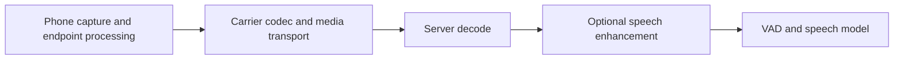

# Audio frontends: preserve speech while removing interference

[Handbook](https://github.com/RobStrayer/voice-agent-skills/blob/main/docs/handbook.md) / [Audio frontend skill](../SKILL.md)

Reviewed: **2026-09-30 UTC**. Processing choices and test procedures here are original engineering guidance. Linked provider contracts were checked on that date; living pages usually do not establish a publication date. No model, audio benchmark, or provider call was run for this review.

An audio frontend decides which samples reach recognition and turn detection. Choose it against a specific failure: agent speech returning through a speaker, a fan keeping VAD active, background conversation becoming a command, or quiet words disappearing. Record the existing processing before adding another stage.

## Contents

- Start with the symptom
- Choose the operation that matches the interference
- Put processing where its inputs exist
- Keep the echo reference aligned during double-talk
- Preserve the format contract
- Compare deployment choices
- Diagnose a noisy call without hiding the user
- Run a paired test that catches information loss

## Start with the symptom

| Symptom or job | First check | Next section |
| --- | --- | --- |
| Agent interrupts its own speaker audio | Capture AEC and render-reference routing | [Echo and double-talk](#keep-the-echo-reference-aligned-during-double-talk) |
| Quiet words vanish after filtering | Bypass the added enhancement; inspect onsets and clipping | [Diagnostic order](#diagnose-a-noisy-call-without-hiding-the-user) |
| Choose a processing stage | Match the interference to the operation | [Operations](#choose-the-operation-that-matches-the-interference), then [deployment](#compare-deployment-choices) |
| Distorted audio or unexplained delay | Format and timestamp contract at each boundary | [Formats](#preserve-the-format-contract) |
| Decide whether a filter helped | Paired fixtures with speech-preservation evidence | [Paired testing](#run-a-paired-test-that-catches-information-loss) |

## Choose the operation that matches the interference

| Operation | What it changes | What to check |
| --- | --- | --- |
| Acoustic echo cancellation (AEC) | Estimates and removes playback leaking into microphone capture; conventional AEC uses a render reference. | Reference routing, timing, output device, room changes, and preservation of simultaneous user speech. |
| Noise suppression | Attenuates interference such as fan or traffic noise. | Speech distortion, transient noise, and whether competing voices are preserved. |
| Noise gate | Attenuates audio below an opening threshold, often with attack, release, and hysteresis. | Quiet syllables, onset clipping, and repeated opening/closing. It does not separate overlapping speech from noise. |
| Automatic gain control (AGC) | Adjusts signal level over time. | Clipping, gain changes during pauses, and raised background noise. It cannot reconstruct a word already removed. |
| Beamforming | Combines microphone-array channels to favor a direction. | Geometry, channel synchronization, speaker position, and reflections. Preserve array channels until this operation finishes. |
| Dereverberation | Reduces room reflections and lingering speech energy. | Lost consonants, altered tails, and added processing delay. |
| Speaker isolation | Emphasizes a selected or primary speaker while suppressing other voices. | Intended multi-speaker conversations and diarization. Isolation is not identity verification. |

The [Microsoft Audio Stack DSP reference](https://learn.microsoft.com/en-us/azure/ai-services/speech-service/audio-processing-speech-sdk) documents beamforming, dereverberation, AEC, AGC, and suppression as separate enhancements. Its supported pipeline needs microphone geometry and a loopback/reference channel for AEC. These requirements are specific to that stack.

## Put processing where its inputs exist

A browser or native capture SDK can see device input and playback. An agent server typically receives encoded or decoded capture after device processing. A phone endpoint may already apply undocumented processing before the carrier delivers media. Treat those upstream effects as unknown until measured or documented.

[Editable diagram](../assets/echo-processing.svg). Endpoint capture uses its own render reference. The server enhancement stage is optional.

Capture processing can include AEC, suppression, and AGC, depending on the device. The server enhancement is optional, and its input is already capture-processed when those features are enabled. The AEC reference belongs to the rendering endpoint; the arrow does not imply that a remote server automatically receives it.

For a phone call, investigate echo at the caller's endpoint and the actual carrier/media path. The agent's generated TTS file alone lacks the caller's playback timing, speaker behavior, and capture clock. A noise filter on received media cannot substitute for a working endpoint echo-reference path.

For browser capture:

1. Request appropriate `echoCancellation`, `noiseSuppression`, and `autoGainControl` constraints.
2. Inspect support and the track's actual `getSettings()`.
3. Repeat that inspection after device changes.

A boolean is a preference; an `exact` constraint can reject an unsatisfiable request. Settings establish configuration, not cancellation quality. [MDN capture constraints](https://developer.mozilla.org/en-US/docs/Web/API/Media_Capture_and_Streams_API/Constraints), [echo cancellation](https://developer.mozilla.org/en-US/docs/Web/API/MediaTrackConstraints/echoCancellation).

## Keep the echo reference aligned during double-talk

In reference-based AEC, feed the playback/render stream through the supported reference API while processing microphone capture. Check delay, clock drift, dropped reference frames, and changes in output routing. Clipping and nonlinear speaker behavior complicate the relationship between digital playback and captured echo. The current [WebRTC APM interface](https://webrtc.googlesource.com/src/+/refs/heads/main/api/audio/audio_processing.h) distinguishes capture `ProcessStream()` from render `ProcessReverseStream()`.

| Acoustic fixture | What to inspect |
| --- | --- |
| Far-end-only playback | Residual agent echo reaching capture |
| Near-end-only speech | Preserved user words, including quiet onsets |
| Double-talk: "wait, change that" during agent speech | Whether the genuine interruption survives; quiet output may mean it was suppressed |
| Device movement, volume change, Bluetooth switch, reconnect | Reference routing and timing after the change |

A headset comparison helps isolate the acoustic path; it does not prove every remaining fault is AEC.

Avoid muting microphone input for the entire agent utterance when interruption is a product requirement. That prevents the system from observing genuine barge-in. Route an identified echo problem to its processing owner before raising VAD thresholds.

## Preserve the format contract

Record codec, container/raw format, rate, channel order, sample width, byte order, numeric scale, frame size, and timestamps at each boundary.

- Decode compressed audio before a PCM processor.
- Downmix after any array-dependent operation.
- Convert the reference channel separately; do not average it into user speech.

RNNoise's example consumes raw mono 16-bit PCM at 48 kHz. Its C API accepts float buffers, and the demo converts integer-valued PCM directly to floats. Confirm numeric scale when adapting normalized browser samples. Obtain frame size through `rnnoise_get_frame_size()` instead of assuming an arbitrary WebSocket chunk is one processing frame. [RNNoise README](https://gitlab.xiph.org/xiph/rnnoise/-/blob/main/README), [API](https://gitlab.xiph.org/xiph/rnnoise/-/blob/main/include/rnnoise.h), and [demo](https://gitlab.xiph.org/xiph/rnnoise/-/blob/main/examples/rnnoise_demo.c).

Use a stateful resampler and preserve continuous timestamps across chunks. Relabeling 24 kHz samples as 48 kHz changes their interpreted duration. Upsampling narrowband phone audio does not recover missing frequencies. Count processing lookahead, frame accumulation, resampling, and queue delay separately; offline trimming of output cannot remove live algorithmic delay.

## Compare deployment choices

| Choice | Suitable ownership boundary | Deployment and license limits |
| --- | --- | --- |
| Browser/WebRTC APM | Device capture and render, including echo | Browser behavior varies. Standalone upstream WebRTC code has [BSD-3-Clause terms](https://webrtc.googlesource.com/src/+/refs/heads/main/LICENSE); dependency and packaged-browser terms are separate. |
| RNNoise | Local microphone or decoded server input noise suppression | Portable C integration; 48 kHz example contract. Root [COPYING](https://gitlab.xiph.org/xiph/rnnoise/-/blob/main/COPYING) is BSD-3-Clause; retain file-level notices. Separately sourced models/training data need their own review. |
| DeepFilterNet | Local or server speech enhancement | [README](https://github.com/Rikorose/DeepFilterNet) describes 48 kHz full-band processing and a 48 kHz WAV CLI; a file helper is not a complete streaming adapter. Code is MIT OR Apache-2.0 under its [LICENSE](https://github.com/Rikorose/DeepFilterNet/blob/main/LICENSE). Pin the chosen model artifact and retain its applicable terms. |
| LiveKit enhanced processing | Frontend, agent input, or SIP trunk, as supported | Cloud provides the Krisp/ai-coustics route. The agent-side ai-coustics plugin also supports a self-hosted SFU with a separately supplied license key and direct ai-coustics billing. Commercial model terms remain separate from the framework license. |
| Provider speech processing | Provider input buffer or supported native SDK | Check exact API, language, platform, and service/SDK terms. The provider may expose no processed samples or internal quality metric. |

LiveKit's [current cancellation guide](https://docs.livekit.io/transport/media/noise-cancellation) distinguishes these integrations:

| Location | Model or API named in the guide |
| --- | --- |
| Agent input, Krisp | VIVA and VIVA telephony; Python `krisp.voice_isolation()` and `krisp.voice_isolation_telephony()` |
| Frontend | BVC; check client support by SDK |
| SIP trunk | NC |

Avoid stacked enhanced frontend/agent filters. Standard capture suppression and
separate AEC can remain enabled.

The [ai-coustics self-hosted section](https://docs.livekit.io/transport/media/noise-cancellation#self-hosted-auth) specifies direct authentication through `auth`. Agent hosting location alone does not establish that configuration.

OpenAI's [Realtime reference](https://developers.openai.com/api/reference/resources/realtime) places input noise reduction before VAD and model processing. Its `near_field` and `far_field` profiles describe microphone use. Select against the current Realtime schema, not an older beta field layout.

Azure MAS DSP is documented for C++, C#, and Java on Windows/Linux, with minimum
16 kHz input and integral multiples of 16 kHz for downsampling. Neither interface
establishes a universal configuration for every platform.

## Diagnose a noisy call without hiding the user

Suppose a laptop agent interrupts itself when its speaker plays, a desk fan prolongs turns, and whispered corrections vanish after adding suppression. Preserve the same authorized capture and render fixture. Keep model, transcript prompts, output volume, and turn settings fixed.

| Order | Change or inspection | Evidence to keep |
| --- | --- | --- |
| 1 | Compare headphones with speaker playback; inspect capture AEC and render reference | Echo behavior on the same fixture |
| 2 | Bypass only the added enhancement; retain known capture configuration | Whisper onsets and trailing consonants |
| 3 | Test environmental suppression against the fan | Preserved speech and reduced interference; use isolation only if nearby speech is unwanted |
| 4 | Inspect clipping before adjusting gain | Samples and level behavior |
| 5 | Select the frontend, then recalibrate VAD/EOT on its output | Speech-start/end decisions and subgroup results |

Changed signal energy can move detector decisions. Threshold tuning cannot restore deleted words. Keep language, accent, distance, and quiet-speech results separate.

## Run a paired test that catches information loss

Paired-test setup:

- [ ] Use the same authorized source for bypass and candidate processing.
- [ ] Preserve capture, render reference, processed output, configuration, timestamps, and ground-truth words.
- [ ] Store recordings privately under the retention policy.
- [ ] For endpoint AEC, use synchronized capture/render or controlled acoustic replay.
- [ ] Label earlier device processing; call capture "unprocessed" only when that is accurate.

Replaying microphone audio into a server filter alone cannot fully assess browser/device AEC.

Use fixtures for silence/noise, normal and quiet speech, fan/transients, competing talkers, reverberation, far-end-only echo, and double-talk. Include supported devices, codecs, languages, and distances. Do not normalize each output separately before checking gain or clipping, since that can conceal a processing failure.

| Evidence | Calculation or observation | Qualification |
| --- | --- | --- |
| Residual echo | Playback-correlated residual and energy in controlled far-end-only windows | Align signals and report the selected windows. Noise and nonlinear echo confound simple correlation. |
| Echo attenuation | `10 * log10(sum(input_echo^2) / sum(residual_echo^2))` in isolated echo windows | ERLE-style estimate, not a valid aggregate over double-talk or mixed speech/noise. Muting everything can score well while destroying speech. |
| Information loss | WER/CER and deletion errors, plus exact names, numbers, and correction words | Keep recognizer/version fixed; state normalization and language. Count hallucinations separately on no-speech windows. |
| Turn behavior | Missed/false starts, onset clipping, premature ends, false barge-ins, and end-detection delay | Compare the same labeled turns. Preserve genuine interruption recall alongside lower false-trigger counts. |
| Runtime | Added algorithmic delay, processing duration distribution, queue growth, and dropped frames | A mean real-time factor below one can still conceal stalls; measure on the deployment hardware. |

With aligned clean reference speech, signal distortion and intelligibility measures can supplement listening. Treat reference-free quality predictors as model estimates. The [AEC Challenge](https://www.microsoft.com/en-us/research/academic-program/acoustic-echo-cancellation-challenge-icassp-2023/) separates single-talk/double-talk and recognition outcomes; [AECMOS research](https://www.microsoft.com/en-us/research/?p=837829) evaluates echo and other degradation separately. Neither supplies a quality guarantee for a new deployment.

Choose the smallest processing configuration that improves the target failures while preserving required words and interruptions. Report cohort counts, regressions, unknown upstream processing, and measured delay. If speaker isolation removes another authorized participant, change the mode or conversation design before calling the test successful.
