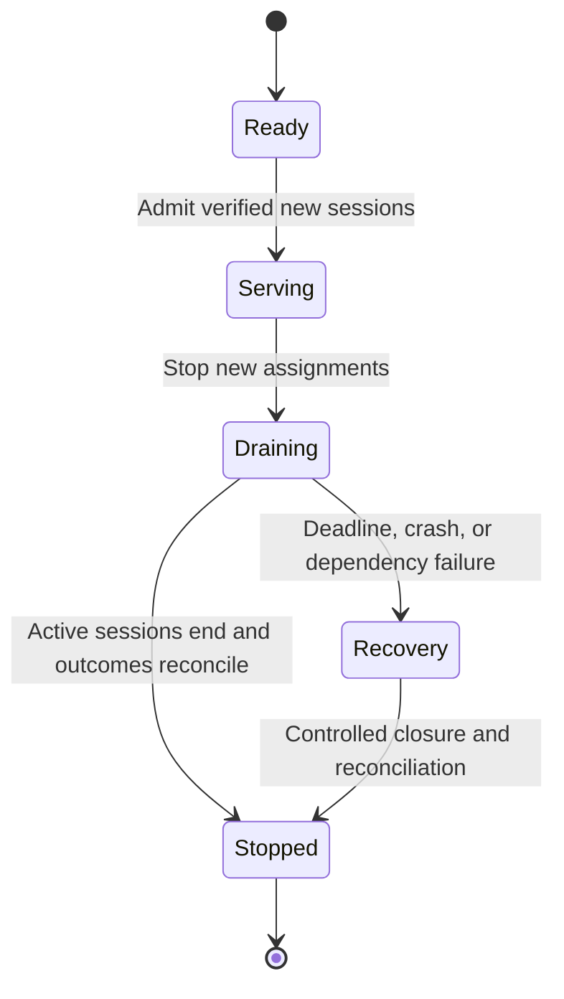
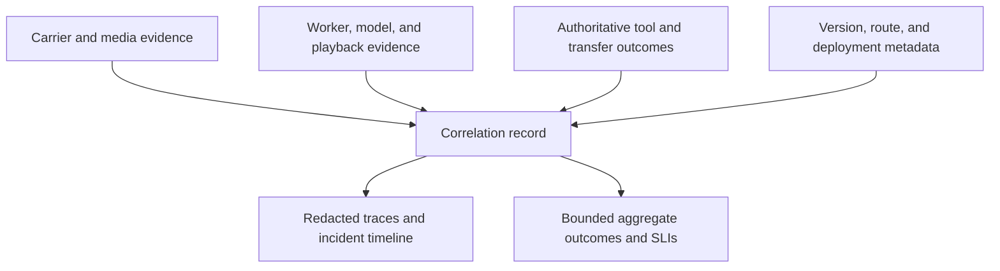

# Production operations: protect sessions and reconcile outcomes

Reviewed against current primary documentation on **September 30, 2026 UTC**. The examples and worksheets are engineering guidance, not measured service levels. Pin installed SDKs and runtime configuration; provider quotas, prices, and regional behavior require current account-specific evidence.

## Admission is a product decision

Separate session-start requests, active conversations, and tool work. A worker with spare CPU may still lack model quota, a media connection, or an available booking service. Authenticate starts, bound pending work, and admit only when the complete route can serve the call. Distinguish rejected starts, caller abandonment while waiting, and failures after admission.

Declare the overload experience for each channel. A browser can show waiting or a retry; a phone caller needs an intentional message, route, or termination policy. Keep waits bounded by the chosen experience requirement. Do not repeatedly create rooms, dial attempts, or provider sessions while hoping capacity appears. Reserve capacity for active calls and recovery, and make downstream tool queues visible.

Pipecat's production guide separates bot code, session-start dispatch, and media transport. Its development runner is not a supported production dispatcher: the documented missing controls include authentication, backpressure, and lifecycle management. Hosting a demo endpoint behind a public URL does not supply them. [Pipecat production](https://docs.pipecat.ai/pipecat/deployment/running-bots-in-production).

LiveKit agent servers advertise availability and capacity and can run isolated job processes. Current self-hosted server options expose load controls, while some load controls are not configurable in LiveKit Cloud. Do not copy a self-hosted tuning recipe into managed hosting without checking the supported control surface. [Agent lifecycle](https://docs.livekit.io/agents/server/lifecycle/), [server options](https://docs.livekit.io/agents/server/options/).

## Size for occupancy, bursts, and the weakest dependency

An average arrival rate multiplied by average duration estimates steady-state occupancy under the appropriate assumptions. It does not establish peak sessions, burst starts, or safe capacity. Measure both occupancy and arrival bursts at a stated interval; retain duration tails, channel/language mix, disconnect retries, and the period covered.

Replay an observed traffic trace before inventing a smooth load profile. Measure cold starts separately from warm admission. Include process startup, model/asset initialization, transport creation, credentials, and provider connection setup. A warm pool exchanges idle cost for startup tolerance; it still needs health, quota, and dependency checks.

Find the limiting resource across active sessions, simultaneous starts, CPU/memory, model/audio quotas, tool concurrency, WebSocket/file descriptors, relay bandwidth, and carrier call-rate limits. A limit in calls per second is not a limit in concurrent calls; model requests per minute are not audio-session capacity. Conferences and warm transfers can temporarily add legs and participants per caller. Measure that amplification.

Load tests should include a burst, long-duration calls, a cold fleet, a slow tool, and loss of a worker or upstream dependency. Report admission delay, failed starts, active-call failures, queue growth, and authoritative task outcomes beside latency. Increase load only within the approved test environment and budget. **SIPp** can generate signaling traffic with rate and concurrent-call controls; add media/application assertions because protocol success does not establish useful conversations. [SIPp traffic control](https://sipp.readthedocs.io/en/latest/controlling.html), [current documentation source](https://github.com/SIPp/sipp/blob/master/docs/controlling.rst).

TURN belongs in the capacity model when used. coturn deployments expose listener and relay-port requirements, and credentials can be time-limited. Inspect relay allocations, bandwidth, exhausted port ranges, and the route clients actually selected. A healthy agent process cannot fix a saturated relay. [coturn deployment](https://github.com/coturn/coturn/blob/master/docker/coturn/README.md), [authentication mechanisms](https://github.com/coturn/coturn).

## Drain before replacing, and define the deadline outcome

Plan a rollout around conversations that may last minutes, not ordinary short HTTP requests. Stop assigning new sessions to the old version, route new work to verified healthy capacity, let existing sessions finish, and reconcile outcomes before releasing resources. Keep control handlers and callback routes valid for the versions still serving calls.

LiveKit's production startup mode documents graceful shutdown: stop accepting jobs, wait for active jobs up to `drain_timeout`/`drainTimeout`, then close connections and clean up. That configurable timeout is a termination boundary, not a promise that every caller will finish. Set orchestrator grace periods consistently with the measured call-duration tail and the explicit deadline recovery policy. [Startup and draining](https://docs.livekit.io/agents/server/startup-modes/).

This conceptual state model is a deployment policy, not a runtime API.

Autoscaling usually changes where new work lands. Do not describe it as live migration of an established audio session. LiveKit documents replacement-agent dispatch after unexpected disconnection, but recovering a room does not automatically recover private memory, pending tool results, or caller-heard history. Recover durable state and test the caller experience before claiming session continuity. [Lifecycle recovery](https://docs.livekit.io/agents/server/lifecycle/).

## Bound failover by the layer that failed

Distinguish transport, speech provider, worker, and business-service failures. A different model cannot restore an ended carrier leg; a restarted worker cannot know an uncertain booking committed unless it reconciles authoritative state. Define a permitted fallback for each failure, including when the honest answer is controlled degradation.

Provider substitution needs tested codecs, event mappings, turn ownership, cancellation, language behavior, tool schemas, and context reconstruction. Preserve played versus generated output and committed actions. Failover must stay within approved processing/retention regions and access scope; do not use an unverified region to make an availability graph look better. Retry starts and read operations with bounded backoff where supported. For non-idempotent writes, an empty status lookup after timeout can remain ambiguous; retain uncertainty rather than blindly replaying.

## Observe the layers and keep identifiers out of metric labels

Map one attempt across carrier call legs/SIP dialogs, room/participant, worker job, stream, turn, model response, transfer, and business action. Use documented identifiers and an application correlation record when namespaces differ. Keep high-cardinality identifiers in access-controlled traces/logs rather than creating a metrics series per call.

For each layer, record timestamps with clock domain and provenance. A generated audio event, runtime playback report, carrier mark, and caller recording have different meanings. Missing playback must remain missing. Use raw correlated records for root-cause work; do not produce a caller-audible percentile by adding component percentiles. Use `voice-latency-audit` for deeper timing investigation if that skill is installed. [Twilio mark/clear contract](https://www.twilio.com/docs/voice/media-streams/websocket-messages).

Define service indicators before targets:

| Indicator | Numerator and denominator | Important qualification |
| --- | --- | --- |
| Admission | Admitted starts / eligible authorized start attempts | Separate policy rejection, capacity rejection, and caller abandonment. |
| Call connection | Answered/connected attempts / eligible dial or inbound attempts | Connection is not a verified human conversation. |
| Usable audio | Sessions with validated two-way media / eligible connected sessions | State the evidence source and missing coverage. |
| Useful response delay | Per-turn speech-end to useful audible response | Name clock alignment, measurement coverage, and percentile method. |
| Handoff | Confirmed intended human handoffs / requested eligible handoffs | Ringing and transfer acknowledgement do not establish human acceptance. |
| Business correctness | Correct authoritative outcomes / eligible attempted tasks | Keep uncertain writes, duplicates, and failed actions visible. |
| Recovery | Reconciled incidents / incidents requiring recovery | Distinguish successful new-session routing from restored active-call continuity. |

Choose targets with the owner from measured baselines and caller needs. Do not invent a universal latency percentile, availability percentage, or retention period. Slice outcomes by deployment, channel, language, region, load, and engine without hiding sparse groups or failures.

Redact at collection where possible. Omit credentials, unnecessary tool payloads, full account identifiers, and sensitive free text from routine diagnostics. Store necessary recordings separately with explicit access, retention, deletion, and regional controls. Sampling must retain outcome counters and enough bounded failure evidence to diagnose incidents; a sampled trace is not the full denominator. Verify the configured retention and export path rather than relying on a vendor dashboard label.

## Reconcile cost in the same units that are billed

Inventory carrier leg minutes and numbers, media/transport, model/audio or token usage, STT/TTS where separately billed, active compute, warm idle capacity, storage, recordings, egress, observability, and hosted platform fees. Track connected time, active speech, generated-but-discarded audio, tokens, and compute independently. Do not double-count components already included in a platform charge.

Transfer and conference legs, failed starts, retries, test runs, and abandoned calls can consume units without completing a task. Match usage to application attempts and provider invoice periods, then reconcile discrepancies. Use current rates, account minimums, and the combined monthly ceiling; a minute-price comparison alone misses idle fleets and failed outcomes. Treat automated budget enforcement as a routing decision with a defined effect on active callers, not an abrupt surprise shutdown.

## Use an operating worksheet, then exercise it

| Area | Record before release | Evidence or drill |
| --- | --- | --- |
| Ownership | Incident owner, authorized account/routes, on-call contact path | Named person can reach logs and execute approved recovery. |
| Admission | Active/start/tool limits; queue bounds; caller feedback | Warm/cold burst with explicit rejection and abandonment accounting. |
| Capacity | Observation horizon, tails, headroom, every downstream quota | Measured trace replay and one-dependency failure. |
| Deployment | Version pin, new-session switch, drain/grace deadlines | Update while long calls and pending writes remain active. |
| Failover | Allowed layer, region, state recovery, abort conditions | Simulated dependency loss with no duplicate write. |
| Evidence | Correlation map, timing definitions, redaction, retention | Reconstruct one failed call without exposing credentials. |
| Money | Current rate units, expected totals, guardrails, invoice reconciliation | Account for a failed start and a two-leg handoff. |

Roll out through fixtures, staging, then a bounded authorized canary. Shadow comparisons may inspect inputs or prepare proposals; they must not dial a second destination or perform duplicate business writes. Establish stop conditions from the agreed indicators, preserve the old route for new-session rollback, and expand only when task outcomes and caller experience support it.

During an incident: restrict unsafe new admissions, identify affected attempts and versions, preserve active-call truth, apply the tested recovery route, reconcile orphaned legs/workers/actions, and confirm provider usage. Preserve a redacted evidence window before changing configuration. The incident report should name the trigger, actual blast radius, incomplete outcomes, correction, regression fixture, and remaining limits. A green infrastructure dashboard is insufficient if callers still have unresolved bookings or failed handoffs.
