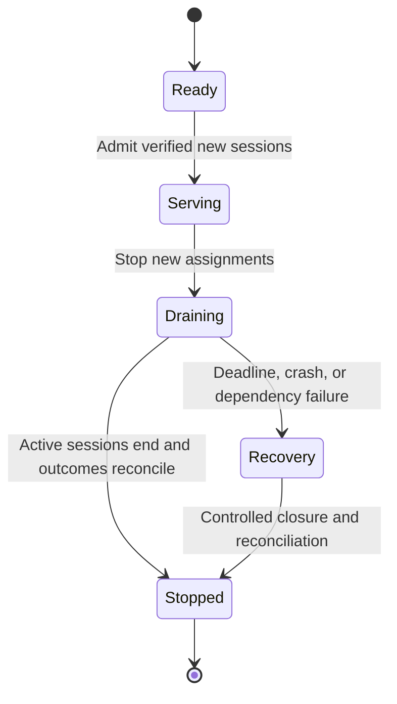
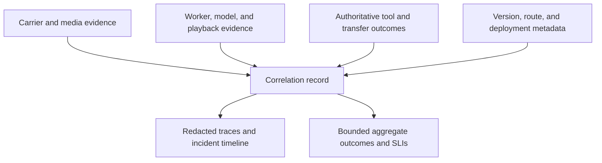

# Production operations: protect sessions and reconcile outcomes

[Handbook](../../../../docs/handbook.md) / [Call reliability skill](../SKILL.md)

Reviewed against current primary documentation on **September 30, 2026 UTC**. The examples and worksheets are engineering guidance, not measured service levels. Pin installed SDKs and runtime configuration; provider quotas, prices, and regional behavior require current account-specific evidence.

## Pick the operating decision

| Your job | Start here | Required output |
| --- | --- | --- |
| Define overload behavior | [Admission](#admission-is-a-product-decision) | Bounded queues and channel-specific caller feedback |
| Plan capacity or a load test | [Occupancy and dependencies](#size-for-occupancy-bursts-and-the-weakest-dependency) | Peak/start limits and weakest-dependency evidence |
| Deploy during active calls | [Draining](#drain-before-replacing-and-define-the-deadline-outcome) | New-session switch, grace deadline, and recovery policy |
| Design failover | [Failure layers](#bound-failover-by-the-layer-that-failed) | Tested fallback with preserved action/history truth |
| Set indicators and diagnose incidents | [Observability](#observe-the-layers-and-keep-identifiers-out-of-metric-labels) | Correlation map, denominators, and evidence boundaries |
| Release or respond to an incident | [Operating worksheet](#use-an-operating-worksheet-then-exercise-it) | Drill evidence and named recovery ownership |

## Admission is a product decision

Separate session-start requests, active conversations, and tool work. A worker with spare CPU may still lack model quota, a media connection, or an available booking service. Authenticate starts, bound pending work, and admit only when the complete route can serve the call. Distinguish rejected starts, caller abandonment while waiting, and failures after admission.

| Channel or resource | Overload policy to define |
| --- | --- |
| Browser | Waiting or retry behavior, with a bounded wait |
| Phone | Intentional message, route, or termination policy |
| Active calls and recovery | Reserved capacity and visible downstream tool queues |
| New-session creation | Admission limits; no repeated room, dial, or provider-session creation while waiting |

Pipecat's production guide separates bot code, session-start dispatch, and media transport. Its development runner is not a supported production dispatcher: the documented missing controls include authentication, backpressure, and lifecycle management. Hosting a demo endpoint behind a public URL does not supply them. [Pipecat production](https://docs.pipecat.ai/pipecat/deployment/running-bots-in-production).

LiveKit agent servers advertise availability and capacity and can run isolated job processes. Current self-hosted server options expose load controls, while some load controls are not configurable in LiveKit Cloud. Do not copy a self-hosted tuning recipe into managed hosting without checking the supported control surface. [Agent lifecycle](https://docs.livekit.io/agents/server/lifecycle/), [server options](https://docs.livekit.io/agents/server/options/).

## Size for occupancy, bursts, and the weakest dependency

An average arrival rate multiplied by average duration estimates steady-state occupancy under the appropriate assumptions. It does not establish peak sessions, burst starts, or safe capacity. Measure both occupancy and arrival bursts at a stated interval; retain duration tails, channel/language mix, disconnect retries, and the period covered.

Replay an observed traffic trace before inventing a smooth load profile. Measure cold starts separately from warm admission. Include process startup, model/asset initialization, transport creation, credentials, and provider connection setup. A warm pool exchanges idle cost for startup tolerance; it still needs health, quota, and dependency checks.

| Capacity boundary | Unit to preserve |
| --- | --- |
| Active sessions and simultaneous starts | Occupancy and start rate separately |
| Runtime | CPU/memory and WebSocket/file descriptors |
| Speech provider | Model/audio quota; requests per minute do not establish audio-session capacity |
| Business tools | Concurrent work and queue depth |
| Media relay and carrier | Bandwidth, allocations, and call-rate limits; calls per second differ from concurrent calls |
| Conferences and warm transfers | Extra legs/participants per caller |

Find the weakest boundary and measure transfer amplification.

Load-test plan:

| Set up | Report |
| --- | --- |
| Burst starts, long calls, cold fleet, slow tool, worker/upstream loss | Admission delay, failed starts, active-call failures, queue growth, authoritative outcomes, and latency |
| Approved environment and budget | Actual load and scope |

SIPp supports signaling rate and concurrent-call controls. Add media/application
assertions; protocol success does not establish useful conversations.
[SIPp traffic control](https://sipp.readthedocs.io/en/latest/controlling.html), [current documentation source](https://github.com/SIPp/sipp/blob/master/docs/controlling.rst).

TURN belongs in the capacity model when used. coturn deployments expose listener and relay-port requirements, and credentials can be time-limited. Inspect relay allocations, bandwidth, exhausted port ranges, and the route clients actually selected. A healthy agent process cannot fix a saturated relay. [coturn deployment](https://github.com/coturn/coturn/blob/master/docker/coturn/README.md), [authentication mechanisms](https://github.com/coturn/coturn).

## Drain before replacing, and define the deadline outcome

Deployment sequence:

1. Stop assigning new sessions to the old version.
2. Route new work to verified healthy capacity.
3. Let existing sessions finish under the deadline policy.
4. Reconcile outcomes before releasing resources.

Keep control handlers and callback routes valid for every version still serving calls.
Conversations may last minutes, so a short-HTTP-request rollout policy is insufficient.

LiveKit's production startup mode documents graceful shutdown: stop accepting jobs, wait for active jobs up to `drain_timeout`/`drainTimeout`, then close connections and clean up. That configurable timeout is a termination boundary, not a promise that every caller will finish. Set orchestrator grace periods consistently with the measured call-duration tail and the explicit deadline recovery policy. [Startup and draining](https://docs.livekit.io/agents/server/startup-modes/).

This conceptual state model is a deployment policy, not a runtime API.

Autoscaling usually changes where new work lands. Do not describe it as live migration of an established audio session. LiveKit documents replacement-agent dispatch after unexpected disconnection, but recovering a room does not automatically recover private memory, pending tool results, or caller-heard history. Recover durable state and test the caller experience before claiming session continuity. [Lifecycle recovery](https://docs.livekit.io/agents/server/lifecycle/).

## Bound failover by the layer that failed

Distinguish transport, speech provider, worker, and business-service failures. A different model cannot restore an ended carrier leg; a restarted worker cannot know an uncertain booking committed unless it reconciles authoritative state. Define a permitted fallback for each failure, including when the honest answer is controlled degradation.

Failover checklist:

- [ ] Test codecs, event mappings, turn ownership, cancellation, languages, tools, and context reconstruction.
- [ ] Preserve played versus generated output and committed actions.
- [ ] Stay within approved processing/retention regions and access scope.
- [ ] Retry starts/reads with bounded backoff where supported.
- [ ] Reconcile non-idempotent writes; an empty lookup after timeout can remain ambiguous.

## Observe the layers and keep identifiers out of metric labels

Map one attempt across carrier call legs/SIP dialogs, room/participant, worker job, stream, turn, model response, transfer, and business action. Use documented identifiers and an application correlation record when namespaces differ. Keep high-cardinality identifiers in access-controlled traces/logs rather than creating a metrics series per call.

Timing checklist:

- [ ] Record clock domain and provenance for each timestamp.
- [ ] Distinguish generated audio, runtime playback, carrier marks, and caller recordings.
- [ ] Retain missing playback as missing.
- [ ] Use raw correlated records; never add component percentiles to produce a caller-audible percentile.

Use `voice-latency-audit` for deeper timing investigation if installed.
[Twilio mark/clear contract](https://www.twilio.com/docs/voice/media-streams/websocket-messages).

Define service indicators before targets:

| Indicator | Numerator and denominator | Important qualification |
| --- | --- | --- |
| Admission | Admitted starts / eligible authorized start attempts | Separate policy rejection, capacity rejection, and caller abandonment. |
| Call connection | Answered/connected attempts / eligible dial or inbound attempts | Connection is not a verified human conversation. |
| Usable audio | Sessions with validated two-way media / eligible connected sessions | State the evidence source and missing coverage. |
| Useful response delay | Per-turn speech-end to useful audible response | Name clock alignment, measurement coverage, and percentile method. |
| Handoff | Confirmed intended human handoffs / requested eligible handoffs | Ringing and transfer acknowledgement do not establish human acceptance. |
| Business correctness | Correct authoritative outcomes / eligible attempted tasks | Keep uncertain writes, duplicates, and failed actions visible. |
| Recovery | Reconciled incidents / incidents requiring recovery | Distinguish successful new-session routing from restored active-call continuity. |

Choose targets with the owner from measured baselines and caller needs. Do not invent a universal latency percentile, availability percentage, or retention period. Slice outcomes by deployment, channel, language, region, load, and engine without hiding sparse groups or failures.

Diagnostic-data checklist:

- [ ] Redact at collection: omit credentials, unnecessary tool payloads, full account IDs, and sensitive free text.
- [ ] Store necessary recordings separately with access, retention, deletion, and regional controls.
- [ ] Retain outcome counters and bounded failure evidence despite trace sampling.
- [ ] Verify configured retention and export paths.

A sampled trace is not the full denominator. A vendor dashboard label does not
establish the configured data path.

## Reconcile cost in the same units that are billed

| Billable group | Units to reconcile |
| --- | --- |
| Telephony and transport | Carrier-leg minutes, numbers, media/transport |
| Speech and model | Model/audio or token usage; STT/TTS when separately billed |
| Runtime | Active compute and warm idle capacity |
| Supporting services | Storage, recordings, egress, observability, platform fees |

Track connected time, active speech, generated-but-discarded audio, tokens, and
compute independently. Exclude components already included in a platform charge.

Cost-reconciliation sequence:

1. Include transfer/conference legs, failed starts, retries, tests, and abandoned calls.
2. Match usage to application attempts and provider invoice periods; reconcile discrepancies.
3. Apply current rates, account minimums, and the combined monthly ceiling.
4. Define budget enforcement's routing effect on active callers before enabling it.

Units can accrue without a completed task. Per-minute prices alone miss idle
fleets and failed outcomes; budget enforcement must not surprise active callers.

## Use an operating worksheet, then exercise it

| Area | Record before release | Evidence or drill |
| --- | --- | --- |
| Ownership | Incident owner, authorized account/routes, on-call contact path | Named person can reach logs and execute approved recovery. |
| Admission | Active/start/tool limits; queue bounds; caller feedback | Warm/cold burst with explicit rejection and abandonment accounting. |
| Capacity | Observation horizon, tails, headroom, every downstream quota | Measured trace replay and one-dependency failure. |
| Deployment | Version pin, new-session switch, drain/grace deadlines | Update while long calls and pending writes remain active. |
| Failover | Allowed layer, region, state recovery, abort conditions | Simulated dependency loss with no duplicate write. |
| Evidence | Correlation map, timing definitions, redaction, retention | Reconstruct one failed call without exposing credentials. |
| Money | Current rate units, expected totals, guardrails, invoice reconciliation | Account for a failed start and a two-leg handoff. |

Roll out through fixtures, staging, then a bounded authorized canary. Shadow comparisons may inspect inputs or prepare proposals; they must not dial a second destination or perform duplicate business writes. Establish stop conditions from the agreed indicators, preserve the old route for new-session rollback, and expand only when task outcomes and caller experience support it.

### Incident sequence

1. Restrict unsafe new admissions; identify affected attempts and versions.
2. Preserve active-call truth and a redacted evidence window before changing configuration.
3. Apply the tested recovery route.
4. Reconcile orphaned legs, workers, actions, and provider usage.
5. Report the trigger, actual blast radius, incomplete outcomes, correction,
   regression fixture, and remaining limits.

Close the incident using caller and business outcomes, including unresolved bookings
or failed handoffs; infrastructure health alone is insufficient.
