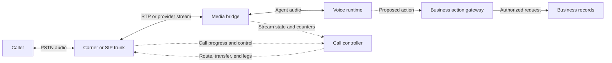
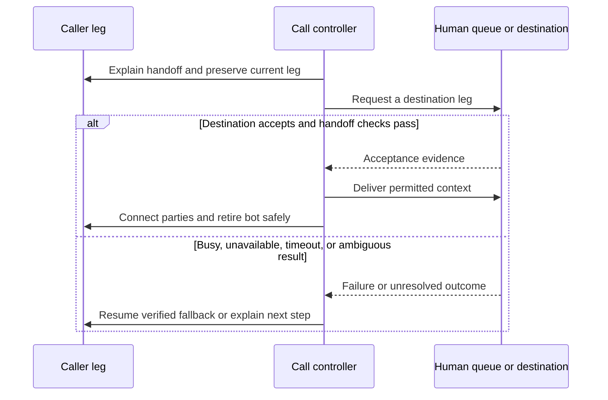

# Telephony: make the call path observable and recoverable

Reviewed against current primary documentation on **September 30, 2026 UTC**. This is a review date, not a publication date. Provider-specific statements are linked; the state machines and failure policies below are engineering guidance. Check the installed SDK, carrier configuration, and exact API version before using field names or transfer behavior.

## Follow two paths, then verify four outcomes

A phone agent has a control path that routes and ends calls, and a media path that carries audio. SIP signaling establishes dialogs and negotiates session descriptions; RTP/SRTP carries media. A successful signaling exchange can coexist with blocked media, the wrong codec, or audio flowing in only one direction. Track signaling, usable conversation, human handoff, and business completion separately.

This conceptual diagram assigns responsibilities. Its labels are not provider event names.

Keep the browser path explicit too: WebRTC may need TURN to traverse a restrictive network. **coturn** provides STUN/TURN media traversal, including supported authentication mechanisms; it does not supply phone numbers, a SIP call controller, or business authorization. Protect relay access, check allocation/relay-port capacity, and verify the selected UDP/TCP/TLS route. A successful TURN allocation is not proof of intelligible audio. [coturn source](https://github.com/coturn/coturn), [deployment ports](https://github.com/coturn/coturn/blob/master/docker/coturn/README.md).

## Build inbound and outbound independently

For inbound calls, identify the dialed number, trunk authentication or source controls, routing/dispatch rule, session admission decision, agent readiness, and the moment media becomes usable. Decide what an early caller hears while a worker starts. Reject or route an unserviceable call deliberately instead of answering it into silence. The calling number is routing metadata; the application must establish any required account identity separately.

For outbound calls, record the authorized destination and attempt ID before requesting a call. Check account routing permissions, caller number configuration, destination format, ringing timeout, and final outcome. Starting a dial request does not mean a person answered. A retry creates a distinct attempt and may create another charge or disturb the same destination; duplicate events must not trigger another dial.

LiveKit uses inbound trunks and dispatch rules for receiving calls, while outbound creation uses `CreateSIPParticipant`. Current documentation exposes `wait_until_answered` and SIP failure information. Its `sip.callStatus` values have specific semantics: `active` signals the connected participant state, and `automation` can indicate connected outbound DTMF processing. Neither establishes a successful conversation. Preserve provider-specific state alongside your normalized state. [Inbound workflow](https://docs.livekit.io/telephony/accepting-calls/workflow-setup/), [outbound workflow](https://docs.livekit.io/telephony/making-calls/workflow-setup/), [participant attributes](https://docs.livekit.io/reference/telephony/sip-participant/).

## Define the media contract at every boundary

Record codec, rate, channel count, byte encoding, packet/frame duration, timestamps, and direction at the carrier, bridge, and model boundaries. Decode and resample exactly where required. Do not attach a WAV header to raw media, reinterpret μ-law bytes as PCM16, or assume a high-rate model stream can be sent unchanged to a narrowband carrier.

Twilio's Media Streams protocol currently specifies μ-law audio at 8 kHz with one channel. Outbound media is base64-wrapped raw audio, and playback is buffered. A returned `mark` may follow `clear` for discarded audio, so correlate media, mark names, and clear operations before claiming playback. Even normal completion evidence is different from a caller-side recording of audible onset. [WebSocket message contract](https://www.twilio.com/docs/voice/media-streams/websocket-messages).

Twilio distinguishes unidirectional and bidirectional streams. Bidirectional streaming exposes the inbound track to the application; its DTMF support is inbound, from Twilio to the media server. Do not assume the same socket sends keypad tones to an external IVR or provides a separate recording of the bot's outbound track. Verify the exact DTMF mechanism and destination leg. [Media Streams overview](https://www.twilio.com/docs/voice/media-streams).

Other bridges use different envelopes. jambonz's `listen` sends linear16 PCM in binary frames. Its streaming return path uses binary frames, while its buffered return path uses JSON with base64 audio; incoming and return sample rates can differ. A `mark` result distinguishes `playout` from `cleared`. `conference` can stream mixed conference audio, which may hide who spoke unless other evidence identifies the participant. Select the correct parser and playback evidence for that bridge. [jambonz listen](https://docs.jambonz.org/verbs/verbs/listen), [clean Markdown contract](https://docs.jambonz.org/verbs/verbs/listen.md), [conference](https://docs.jambonz.org/verbs/verbs/conference).

## Keep answer, machine detection, and task completion separate

Use application states such as `requested → ringing → answered → media_ready → interacting → ending → ended`, with distinct terminal failure branches. Keep detection result, transfer state, and business action status as parallel fields. These are conceptual states, not a sequence every carrier emits.

Twilio's progress callback event `completed` is not identical to a `CallStatus` value of `completed`: the completion event can report other terminal outcomes. Inspect the actual status and the connected leg. An answered and ended call can still have reached voicemail, heard silence, or failed its task. [Call resource](https://www.twilio.com/docs/voice/api/call-resource).

Answering machine detection adds another classifier. Test human, machine, fax where relevant, and unknown outcomes against actual greeting conditions. Synchronous and asynchronous detection affect when conversation proceeds; late detection must not retroactively turn a guessed result into a verified one. Decide what the agent may say or do while classification is unresolved. Record false-human and false-machine outcomes separately from call connection. [Twilio AMD](https://www.twilio.com/docs/voice/answering-machine-detection).

## Make handoff a recoverable transaction

A bridge connects legs; a conference gives the application a participant structure for holds and multi-party handoffs; a cold transfer delegates the caller to another destination. These choices have different ownership after failure. For a warm handoff, keep the caller leg while reaching the human, confirm the destination and acceptance, pass the authorized context, connect the parties, and only then retire the bot leg. Decide who speaks during that transition.

This conceptual sequence is an application policy, not an API recipe.

LiveKit's current cold-transfer guide documents a `ringing_timeout`: unsuccessful timeout leaves the caller in the room. Verify that behavior in the installed integration. Do not generalize it to another carrier's REFER or bridge. A request acknowledgement can leave downstream progress unresolved, and some transfer mechanisms relinquish the original bot's control. [LiveKit cold transfer](https://docs.livekit.io/telephony/features/transfers/cold/).

When the human queue is unavailable, use a preapproved return-to-agent, bounded waiting, contact instructions, or a separately authorized callback workflow. Do not claim “connected to a person” from ringing, a conference join, or a transfer request alone.

## Authenticate events, then make effects safe

Validate the provider's webhook authentication before changing call state. Twilio signature verification depends on the exact public request URL and all received parameters; reverse-proxy URL rewriting and omitted new fields can invalidate verification. Use the current helper rather than a home-grown partial reconstruction. For JSON requests, follow the documented raw-body validation path. [Secure webhooks](https://www.twilio.com/docs/usage/webhooks/webhooks-security).

Authentication establishes origin and integrity, not freshness, ordering, or permission to perform a new business action. Store received events durably, correlate them to the correct call leg and session generation, deduplicate with documented event identifiers or a defined equivalent, and apply allowed state transitions atomically. Do not deduplicate all events by call ID: one call legitimately has many updates. Acknowledge only after the event is safely accepted; execute expensive or retryable effects through bounded workers when the webhook contract permits.

## Work failures through the whole lifecycle

| Observation | Evidence to inspect | Recovery and proof |
| --- | --- | --- |
| Answered, but silent | Media counters on both legs, subscription, codec and decoded sample, playback queue | Fix the broken boundary; verify caller-side two-way audio. A signaling test is insufficient. |
| DTMF seen locally, IVR unchanged | Origin/destination leg and supported send direction | Use the verified leg-specific mechanism; test the IVR state, not merely tone logging. |
| Human transfer rings indefinitely | Destination-leg status, timeout, queue availability, original-leg ownership | Apply the configured timeout and proven fallback; avoid an orphaned caller or second dial. |
| Webhook repeated after a timeout | Durable event receipt, transition version, existing action state | Reconcile before repeating the effect; prove one intended transfer/write despite duplicate delivery. |
| Media socket closes while call remains active | Stream termination reason and authoritative call/participant state | Follow the chosen reconnect, reroute, or end-call policy; verify all owned resources afterward. |
| Worker disappears after a booking write | Action ledger and authoritative booking lookup | Record uncertain outcome; do not replay a non-idempotent write solely because lookup is empty. |

Cleanup must reconcile every leg, participant, stream, worker, playback queue, and action. A stream ending is not universal proof the phone call ended; ending the call does not imply a business write rolled back. Make cleanup safe to repeat and use an orphan sweeper with explicit ownership and grace conditions, so late callbacks do not end a newer session.

Use **SIPp** to exercise signaling scenarios, arrival rate, concurrency, and supported RTP replay/echo in an isolated test path. Pair it with real media and business assertions: a passed SIP scenario cannot establish recognition, intelligibility, interruption quality, or human handoff. Start with synthetic destinations and authorize any carrier-connected load separately. [SIPp controls](https://sipp.readthedocs.io/en/latest/controlling.html), [media](https://sipp.readthedocs.io/en/latest/media.html), [current control documentation source](https://github.com/SIPp/sipp/blob/master/docs/controlling.rst), [media source](https://github.com/SIPp/sipp/blob/master/docs/media.rst).
