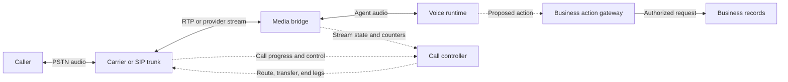

# Telephony: make the call path observable and recoverable

[Handbook](../../../../docs/handbook.md) / [Call reliability skill](../SKILL.md)

Reviewed against current primary documentation on **September 30, 2026 UTC**. This is a review date, not a publication date. Provider-specific statements are linked; the state machines and failure policies below are engineering guidance. Check the installed SDK, carrier configuration, and exact API version before using field names or transfer behavior.

## Find the call failure

| Problem or job | Start here | Evidence required |
| --- | --- | --- |
| Call answers but audio is missing | [Control/media paths](#follow-two-paths-then-verify-four-outcomes) and [media contract](#define-the-media-contract-at-every-boundary) | Two-way media on the actual caller path |
| Build or retry call creation | [Inbound and outbound](#build-inbound-and-outbound-independently) | Routing, admission, attempt IDs, and final outcome |
| Determine who answered | [Answer and machine detection](#keep-answer-machine-detection-and-task-completion-separate) | Separate connection, classifier, and task results |
| Transfer safely | [Recoverable handoff](#make-handoff-a-recoverable-transaction) | Recipient acceptance and caller-leg ownership |
| Handle duplicate or late events | [Event authentication](#authenticate-events-then-make-effects-safe) | Durable receipts and allowed transitions |
| Recover an incident | [Lifecycle failure cases](#work-failures-through-the-whole-lifecycle) | Every owned leg, stream, worker, and action reconciled |

## Follow two paths, then verify four outcomes

A phone agent has a control path that routes and ends calls, and a media path that carries audio. SIP signaling establishes dialogs and negotiates session descriptions; RTP/SRTP carries media. A successful signaling exchange can coexist with blocked media, the wrong codec, or audio flowing in only one direction. Track signaling, usable conversation, human handoff, and business completion separately.

This conceptual diagram assigns responsibilities. Its labels are not provider event names.

WebRTC may need TURN on restrictive networks. coturn supplies STUN/TURN traversal
and supported authentication, but phone numbers, SIP call control, and business
authorization require their own services.

Protect relay access, check allocation/relay-port capacity, and verify the selected
UDP/TCP/TLS route. Allocation success does not prove intelligible audio.
[coturn source](https://github.com/coturn/coturn), [deployment ports](https://github.com/coturn/coturn/blob/master/docker/coturn/README.md).

## Build inbound and outbound independently

| Direction | Record and verify | Failure policy |
| --- | --- | --- |
| Inbound | Dialed number, trunk authentication/source controls, dispatch rule, admission, agent readiness, and usable media | Define early-caller audio; deliberately reject or route an unserviceable call |
| Outbound | Authorized destination, attempt ID, routing permissions, caller number, destination format, ringing timeout, and final outcome | A retry can incur charges and contact the destination again; duplicate events must not redial |

Record the outbound destination and attempt ID before requesting the call; each
retry is a distinct attempt.
Calling number is routing metadata; establish required account identity separately.
A dial request does not establish that a person answered.

| LiveKit boundary | Documented contract |
| --- | --- |
| Inbound | Trunks and dispatch rules |
| Outbound | `CreateSIPParticipant`; `wait_until_answered` and SIP failure information |
| `sip.callStatus`: `active` | Connected participant state |
| `sip.callStatus`: `automation` | Can indicate connected outbound DTMF processing |

Neither status establishes successful conversation. Retain provider-specific state
alongside normalized state. [Inbound workflow](https://docs.livekit.io/telephony/accepting-calls/workflow-setup/), [outbound workflow](https://docs.livekit.io/telephony/making-calls/workflow-setup/), [participant attributes](https://docs.livekit.io/reference/telephony/sip-participant/).

## Define the media contract at every boundary

Record codec, rate, channel count, byte encoding, packet/frame duration, timestamps, and direction at the carrier, bridge, and model boundaries. Decode and resample exactly where required. Do not attach a WAV header to raw media, reinterpret μ-law bytes as PCM16, or assume a high-rate model stream can be sent unchanged to a narrowband carrier.

Twilio's Media Streams protocol currently specifies μ-law audio at 8 kHz with one channel. Outbound media is base64-wrapped raw audio, and playback is buffered. A returned `mark` may follow `clear` for discarded audio, so correlate media, mark names, and clear operations before claiming playback. Even normal completion evidence is different from a caller-side recording of audible onset. [WebSocket message contract](https://www.twilio.com/docs/voice/media-streams/websocket-messages).

Twilio distinguishes unidirectional and bidirectional streams. Bidirectional streaming exposes the inbound track to the application; its DTMF support is inbound, from Twilio to the media server. Do not assume the same socket sends keypad tones to an external IVR or provides a separate recording of the bot's outbound track. Verify the exact DTMF mechanism and destination leg. [Media Streams overview](https://www.twilio.com/docs/voice/media-streams).

For jambonz, select the parser and evidence for the actual path:

| Path or event | Documented contract |
| --- | --- |
| `listen` input | linear16 PCM in binary frames |
| Streaming return | Binary frames |
| Buffered return | JSON with base64 audio |
| Sample rates | Input and return can differ |
| `mark` result | Distinguishes `playout` from `cleared` |
| `conference` audio | May be mixed; participant identity needs other evidence |

[jambonz listen](https://docs.jambonz.org/verbs/verbs/listen), [clean Markdown contract](https://docs.jambonz.org/verbs/verbs/listen.md), [conference](https://docs.jambonz.org/verbs/verbs/conference).

## Keep answer, machine detection, and task completion separate

Use application states such as `requested → ringing → answered → media_ready → interacting → ending → ended`, with distinct terminal failure branches. Keep detection result, transfer state, and business action status as parallel fields. These are conceptual states, not a sequence every carrier emits.

Twilio's progress callback event `completed` is not identical to a `CallStatus` value of `completed`: the completion event can report other terminal outcomes. Inspect the actual status and the connected leg. An answered and ended call can still have reached voicemail, heard silence, or failed its task. [Call resource](https://www.twilio.com/docs/voice/api/call-resource).

For answering machine detection:

- Test human, machine, relevant fax, and unknown outcomes against actual greetings.
- Define conversation behavior while synchronous/asynchronous classification is unresolved.
- Keep a late detection result separate from an earlier guess.
- Record false-human and false-machine outcomes separately from connection.

[Twilio AMD](https://www.twilio.com/docs/voice/answering-machine-detection).

## Make handoff a recoverable transaction

| Handoff mechanism | Ownership to verify |
| --- | --- |
| Bridge | Connected legs and their failure handling |
| Conference | Participant structure, holds, and multi-party ownership |
| Cold transfer | Control delegated to another destination; remaining recovery options |

Warm-handoff sequence:

1. Keep the caller leg while reaching the human.
2. Confirm destination and acceptance; pass authorized context.
3. Connect the parties, then retire the bot leg when the contract permits.

Assign the speaker during each transition.

This conceptual sequence is an application policy, not an API recipe.

[Editable diagram](../assets/recoverable-handoff.html). Warm handoff retains the caller leg while acceptance and connection are checked; failure returns to a supported fallback.

LiveKit's current cold-transfer guide documents a `ringing_timeout`: unsuccessful timeout leaves the caller in the room. Verify that behavior in the installed integration. Do not generalize it to another carrier's REFER or bridge. A request acknowledgement can leave downstream progress unresolved, and some transfer mechanisms relinquish the original bot's control. [LiveKit cold transfer](https://docs.livekit.io/telephony/features/transfers/cold/).

When the human queue is unavailable, use a preapproved return-to-agent, bounded waiting, contact instructions, or a separately authorized callback workflow. Do not claim “connected to a person” from ringing, a conference join, or a transfer request alone.

## Authenticate events, then make effects safe

Validate the provider's webhook authentication before changing call state. Twilio signature verification depends on the exact public request URL and all received parameters; reverse-proxy URL rewriting and omitted new fields can invalidate verification. Use the current helper rather than a home-grown partial reconstruction. For JSON requests, follow the documented raw-body validation path. [Secure webhooks](https://www.twilio.com/docs/usage/webhooks/webhooks-security).

Authentication establishes origin and integrity. Freshness, ordering, and authority
for new business actions require application checks.

- [ ] Store received events durably and correlate the call leg/session generation.
- [ ] Deduplicate by documented event ID or a defined equivalent, not call ID alone.
- [ ] Apply allowed state transitions atomically.
- [ ] Acknowledge after safe acceptance.
- [ ] Use bounded workers for expensive/retryable effects when the webhook contract permits.

One call legitimately has many updates.

## Work failures through the whole lifecycle

| Observation | Evidence to inspect | Recovery and proof |
| --- | --- | --- |
| Answered, but silent | Media counters on both legs, subscription, codec and decoded sample, playback queue | Fix the broken boundary; verify caller-side two-way audio. A signaling test is insufficient. |
| DTMF seen locally, IVR unchanged | Origin/destination leg and supported send direction | Use the verified leg-specific mechanism; test the IVR state, not merely tone logging. |
| Human transfer rings indefinitely | Destination-leg status, timeout, queue availability, original-leg ownership | Apply the configured timeout and proven fallback; avoid an orphaned caller or second dial. |
| Webhook repeated after a timeout | Durable event receipt, transition version, existing action state | Reconcile before repeating the effect; prove one intended transfer/write despite duplicate delivery. |
| Media socket closes while call remains active | Stream termination reason and authoritative call/participant state | Follow the chosen reconnect, reroute, or end-call policy; verify all owned resources afterward. |
| Worker disappears after a booking write | Action ledger and authoritative booking lookup | Record uncertain outcome; do not replay a non-idempotent write solely because lookup is empty. |

Cleanup checklist:

- [ ] Reconcile legs, participants, streams, workers, playback queues, and actions.
- [ ] Check authoritative call state when a stream ends.
- [ ] Keep business-write state independent of call termination.
- [ ] Make cleanup repeatable; give orphan sweepers explicit ownership and grace conditions.
- [ ] Prevent late callbacks from ending a newer session.

Use **SIPp** to exercise signaling scenarios, arrival rate, concurrency, and supported RTP replay/echo in an isolated test path. Pair it with real media and business assertions: a passed SIP scenario cannot establish recognition, intelligibility, interruption quality, or human handoff. Start with synthetic destinations and authorize any carrier-connected load separately. [SIPp controls](https://sipp.readthedocs.io/en/latest/controlling.html), [media](https://sipp.readthedocs.io/en/latest/media.html), [current control documentation source](https://github.com/SIPp/sipp/blob/master/docs/controlling.rst), [media source](https://github.com/SIPp/sipp/blob/master/docs/media.rst).
