# Choosing a voice agent architecture

[Handbook](../../../../docs/handbook.md) / [Stack selection skill](../SKILL.md)

Reviewed against official documentation on **2026-09-30 UTC**. This is a review date,
not a source update date. The reviewed pages did not establish last-modified dates.
Check current documentation and installed versions when using this guide.

Cited provider statements describe documented behavior. Recommendations and conditional
examples are engineering guidance to test, not verified compatibility or performance.

## Choose a starting point

| Your job | Start here | Leave with |
| --- | --- | --- |
| Select a first stack | [Task constraints](#begin-with-the-task), then [speech and hosting](#separate-five-decisions) | Two complete candidates and their blocking unknowns |
| Add web or phone access | [Media paths](#draw-media-and-control-paths) | A channel-specific transport and control map |
| Protect bookings and other writes | [Turn ownership](#assign-turn-ownership), then [authority](#keep-business-authority-in-the-application) | A cancellation and reconciliation contract |
| Fit a budget or traffic forecast | [Capacity and cost](#size-capacity-and-cost-together) | Peak-load evidence and comparable billing units |
| Replace a working stack | [Decision worksheet](#compare-two-or-three-complete-options), then [migration tests](#prove-the-decision-before-migration) | A measured comparison and reversible rollout |

## Begin with the task

A question-answering agent and an agent that changes bookings have different needs.
Write the task in one sentence, then collect constraints that can rule out a design.

| Constraint | What to record |
| --- | --- |
| Channel | Browser, mobile, inbound/outbound phone, existing audio stream, current provider |
| Conversation | Languages, noise, overlap, pronunciation, accessibility, human transfer |
| Actions | Reads versus writes, identity checks, tool APIs, durable records |
| Experience | Response-delay definition, interruption behavior, startup, failure recovery |
| Traffic | Arrival pattern, duration, peak concurrency, geography |
| Operations | Service owner, network placement, retention, residency, deployment restrictions |
| Money | Shared monthly ceiling, traffic, idle capacity, authorized test spending |

Label unknowns. Monthly minutes do not establish peak concurrency. If the requirement
is sub-500 ms and the evidence is provider TTFT logs, start with instrumentation:
those logs cannot establish caller-perceived response delay.

## Separate five decisions

| Decision | What it owns | What still needs an owner |
| --- | --- | --- |
| Speech engine | Recognition, reasoning, speech, together or in stages | Transport, authorization, durable state |
| Orchestration | Context, tools, turns, adapters | Production hosting unless included |
| Media transport | Audio, codec, buffering, connection lifecycle | Model behavior, business outcomes |
| Runtime | Startup, compute, capacity, deployment, shutdown | Correctness, provider quotas |
| Business service | Identity, permissions, records, action reconciliation | Voice interaction, playback |

Managed hosting and native speech-to-speech are independent choices. A hosted runtime
can run a chain; a self-hosted application can use a hosted speech model. Pipecat does
not require operating its runtime yourself.

### Choose the speech architecture



[Editable comparison](../assets/speech-architectures.html). These are architectural boundaries, not model-version or performance claims.

OpenAI's current guide distinguishes three paths:

| Path | Documented responsibility |
| --- | --- |
| Realtime | Audio interpretation, reasoning, tools, and speech in one session |
| Chain | Speech recognition, a text agent, and speech generation; “Control over each speech and text stage.” |
| GPT-Live | Spoken interaction with delegated backend work, including client delegation to an existing workflow |

[OpenAI voice agents](https://developers.openai.com/api/docs/guides/voice-agents)

| Task requirement | Candidate to test | Boundary to verify |
| --- | --- | --- |
| Conversational timing and prosody; no text checkpoint before every answer | Native speech-to-speech | Application controls, timing, and playback |
| Inspect or transform intermediate text, reuse a text agent, or choose speech components separately | A speech chain | Recognition, text-agent, and synthesis contracts |
| Keep an existing backend workflow | A delegated conversational layer | Availability and integration; replacement is not automatic |

No speech architecture guarantees lower latency. Streaming, endpointing, model behavior,
and playback affect the result; native speech-to-speech still needs application controls.

Before selecting a chain for a text checkpoint, record:

- When review happens: before every spoken answer, before a tool write, or later.
- What is reviewed: recognized text, a proposed action, or the final record.
- Who reviews it and whether approval is required.

A native speech frontend can submit a text proposal to a trusted action gate before
a write. A checkpoint on that proposal alone does not require a speech chain.

Pipecat composes pipelines from processors and services. Its documented chain includes
transport input, STT, user context, LLM, TTS, transport output, and assistant context.
“Frame processors are modular and reusable.” Replacement is a design option, not proof
that providers share context, cancellation, and tool behavior.
[Pipecat pipelines](https://docs.pipecat.ai/pipecat/learn/pipeline)

### Choose who operates the agent

| Operating model | Responsibility to confirm |
| --- | --- |
| Managed agent platform | Which conversation configuration, routing, and operations it owns |
| Managed runtime | How it hosts your bot code and admits sessions |
| Self-hosted runtime | How your team operates dispatch and session processes |

Pipecat separates the bot, session-start service, and media transport. Pipecat Cloud
runs agents in Daily-hosted regions; Enterprise uses a region in your VPC. Placement
must be checked across the full data path, including external speech services.
[Deployment overview](https://docs.pipecat.ai/pipecat/deployment/overview),
[Cloud and Enterprise](https://docs.pipecat.ai/pipecat-cloud/introduction)

Choose managed hosting when the team cannot support dispatch, isolation, capacity,
and deployment during active calls. Operate the runtime when network placement,
custom audio, isolation, or existing infrastructure justifies that work.

Before choosing either, verify export, debugging, regions, tools, and failure handling.

Pipecat's dedicated production guide calls its development runner “not built for
production.” It lacks production admission and lifecycle controls. A local demo does
not establish a deployment plan.
[Running bots in production](https://docs.pipecat.ai/pipecat/deployment/running-bots-in-production)

## Draw media and control paths



[Editable diagram](../assets/voice-system-map.html). Arrows show logical
responsibilities; output still traverses the deployment's actual media transport.

For OpenAI Realtime, browser initialization can pass through a backend or use a
short-lived client credential minted by the backend. The standard API key stays there.
OpenAI recommends WebRTC for browser/mobile clients and WebSocket for server-to-server.
[Realtime WebRTC](https://developers.openai.com/api/docs/guides/voice-webrtc?api=realtime),
[Realtime WebSockets](https://developers.openai.com/api/docs/guides/voice-websockets?api=realtime)

```text
Browser microphone/speaker <== WebRTC media ==> Realtime session
Browser ---- authenticated setup ----> Application backend
Application backend <== sideband events ==> same session
Application backend ---- authorized tools ----> Business records
```

Realtime documents incoming SIP: configure the trunk, receive the incoming-call webhook,
accept/reject in the application, and attach a control WebSocket using the call ID.
A server sideband for WebRTC or SIP monitors the same session, updates instructions,
and answers tool calls.
[Realtime SIP](https://developers.openai.com/api/docs/guides/voice-sip?api=realtime),
[Server controls](https://developers.openai.com/api/docs/guides/voice-server-controls?api=realtime)

An audio bridge has two connections:

```text
Phone network <== provider media ==> Application relay <== model stream ==> Speech service
                                         |
                                  tools and durable state
```

| Path | Use when | Required ownership |
| --- | --- | --- |
| Direct SIP | Its documented controls and media path satisfy the task | Call admission, session controls, and business service |
| Audio relay | Audio processing, multiple providers, or existing transport logic requires it | Event translation, codec conversion, queue limits, interruptions, and shutdown on both legs |

Verify inbound and outbound support separately.

A text relay differs from raw audio streaming. Twilio ConversationRelay exchanges
speech-related events and application text; bidirectional Media Streams exchanges
audio. A returned media mark can follow a clear, so it alone does not prove that audio
was heard.
[ConversationRelay](https://www.twilio.com/docs/voice/twiml/connect/conversationrelay),
[Media Streams messages](https://www.twilio.com/docs/voice/media-streams/websocket-messages)

Check the exact transport, codec, sample rate, channel count, service, region, SDK,
and tool path. Cite an official example or label adapter work unverified. Test microphone
permissions, reconnects, network changes, and transfers instead of promising them.

## Assign turn ownership

Record who detects turn completion, starts a response, interrupts
speech, cancels generation, stops playback, and reconciles history. Test interacting
automatic policies before adding another detector.

Realtime supports automatic VAD, manual turns, or VAD with automatic response
creation and interruption disabled.

| Transport | Documented output owner |
| --- | --- |
| WebRTC/SIP | Server buffering and automatic truncation of unheard audio on interruption |
| WebSocket | “the client manages audio playback, and thus must stop playback and handle truncation.” Track played duration and send `conversation.item.truncate`. |

Canceling generation alone does not clear a local playback queue.
[Realtime conversations](https://developers.openai.com/api/docs/guides/realtime-conversations#interruption-and-truncation)

Keep three states separate:

| State | Evidence |
| --- | --- |
| Generated | Provider output or response events |
| Played | Transport/player evidence, with its limits |
| Committed | Authoritative business result |

Stop stale generation and queued playback using each leg's supported controls. Reconcile
model context under that API's playback rules. Correlate late tool results with their
action. A cut-off spoken answer does not undo a completed booking.

Use this application policy for action recovery; it is not a voice-provider
cancellation guarantee:

| Situation | Action |
| --- | --- |
| Retry of the same action with API-supported idempotency | Retain the durable action ID and original key under that API's contract |
| API has no idempotency key | Deduplicate dispatch in the application; exactly-once external effects remain unguaranteed |
| Cancellation races with a write, or a tool times out | Query authoritative status before retrying |
| A lagging lookup returns nothing | Keep the outcome uncertain; absence does not prove failure |
| The service cannot establish the outcome | Use the defined operator or user recovery path |

A new turn does not justify another write. Replay only when evidence establishes
that it cannot duplicate a committed effect.

## Keep business authority in the application

Before dispatching an action, the trusted application checks:

- Identity and account permissions.
- Proposed inputs and applicable limits.
- Prior completion of the same action.

Tool arguments, transcripts, and client events are requests. Keep provider and tool
credentials in the trusted service; an ephemeral browser credential does not authorize
access to another account.

A sideband separates private execution from browser media; it does not replace
authorization. Persist outcomes needed after session shutdown. Correlate call, response,
action, and transport events without retaining unnecessary sensitive audio.

Decide when an action becomes committed. If confirmation is required for the task,
obtain it beforehand. Reuse existing authorization instead of adding repeated prompts.

## Size capacity and cost together

Pipecat Cloud runs “one active session at a time” per instance. Warm instances cost
money while idle; `max-agents` limits concurrent instances, and excess starts receive
HTTP 429. Warm capacity and cold startup are separate tradeoffs.
[Cloud scaling](https://docs.pipecat.ai/pipecat-cloud/fundamentals/scaling)

Pipecat's production guidance covers per-session processes and draining old workers
during deployments. Long calls need a different rollout policy from short HTTP requests.
[Session lifecycle](https://docs.pipecat.ai/pipecat/deployment/running-bots-in-production#session-lifecycle)

1. Estimate steady-state concurrency from average arrival rate and duration.
2. Measure peak sessions and arrival bursts separately.
3. Exercise cold startup, warm admission, rejection, quotas, CPU, memory, local
   models, and connections.
4. Define what the caller hears when capacity is unavailable.

The average estimate does not establish peak capacity.

Use current billing units, not remembered prices:

```text
Total =
  phone/transport units × current rate
+ speech/model units × current rate
+ runtime active compute and reserved idle compute
+ platform fees, recording, storage, egress and observability
```

Check included services to avoid double counting. Keep connected time, active speech,
tokens, compute, and reserved capacity distinct. Include retries and failed starts.
Compare the same traffic assumptions and cost per completed task, not only per call.

## Compare two or three complete options

Fill the worksheet and link evidence beside provider-dependent answers. Reject unmet
requirements before scoring convenience.

| Question | Option A | Option B |
| --- | --- | --- |
| Speech path and orchestration | | |
| Browser/phone media path | | |
| Hosting and admission owner | | |
| Turn and playback owner | | |
| Tool authority and durable state | | |
| Adapter work and installed versions | | |
| Latency evidence and boundary | | |
| Capacity and overload behavior | | |
| Cost units, traffic, total | | |
| Data path, retention, regions | | |
| Unknown or blocking test | | |
| Exit path and rewrites | | |

Recommend one default and name the requirement that would change the decision.

### Conditional examples

| Situation | Starting hypothesis | Test that could change it |
| --- | --- | --- |
| Browser tutor, small operations team | WebRTC and a trusted backend if the native model supports the language and controls; compare managed orchestration when needed | Noise, interruptions, permissions, and reconnects |
| Booking on web and phones | A chain, channel adapters, and one action service when the existing text workflow and checkpoint require it | Direct SIP plus Realtime tools/transfer; interrupt an in-flight write |
| Changing speech providers | A modular framework may preserve business code | Context, tools, turns, codecs, and cancellation differences; a component benchmark is insufficient |
| Sporadic traffic, strict budget | Compare startup tolerance with idle capacity cost; include self-hosted compute and its operator | Fund warm capacity or test another path if callers cannot wait; keep web and phone under one ceiling |

### Worked comparison: appointments over web and phone

This is a hypothetical design exercise, not a tested provider recommendation.

| Assumptions | Open questions |
| --- | --- |
| Existing booking service; web and inbound phone; text checkpoint before writes; human escalation; small operating team | Language support, regional processing, and peak load |
| Booking API reports operation status but cannot reliably cancel after dispatch | Whether each candidate meets the checkpoint and transfer requirements |

| Decision | A: staged speech pipeline | B: native speech session |
| --- | --- | --- |
| Input and response | STT revisions → text agent → TTS | Audio interaction in the speech model; auxiliary transcript has its own evidence contract |
| Business checkpoint | Validate text-agent arguments and confirmation | Validate proposed arguments and confirmation; auxiliary text alone cannot prove exact recognized text |
| Web and phone | Channel adapters share the action service; each owns codec/playback | Supported WebRTC/SIP or bridge; verify transfer/playback per path |
| Uncertain booking | Action A remains unresolved when corrected intent B arrives | Same reconciliation requirement |
| Operational cost | More speech-stage boundaries to observe, plus runtime and quotas | Fewer explicit speech stages; session constraints and any bridge/runtime costs remain |
| Replacement cost | Retest segmentation, timing, and cancellation after adapter changes | Remap events, context, voice, tools, and interruptions as required |

Start the comparison with A because the stated text checkpoint and existing text
workflow favor that boundary. Keep B as a candidate if the owner confirms that
validated tool arguments satisfy the checkpoint requirement, or the selected
native path supplies the necessary text evidence. Neither option passes until
language, region, transfer, and load requirements have evidence.

Run the same fixtures and collect:

| Comparison | Required evidence |
| --- | --- |
| Booking, correction, quiet speech, transfer failure | Correct authoritative outcomes before response speed |
| Response and interruption delay | Speech-end to useful playback; interruption-to-stop; compatible clocks and missing coverage |
| Total cost | The same connected time, active speech, tool calls, warm capacity, and transfer legs |

The decision record might read: "Choose A for the initial release if it meets the
agreed conversation and cost criteria. Reopen the choice if B satisfies the text
checkpoint, required regions, and failure tests while improving measured caller
experience enough to justify migration." Fill in actual measurements before
treating that sentence as an approved project decision.

## Prove the decision before migration

Hold task, input audio, tools, and outcome rubric constant. Change
one architecture at a time. Start with synthetic callers and mocked writes, then provider
tests within authorized scope. Record versions, configuration, traffic, review date,
and exact timing boundaries.

The smallest useful comparison covers:

1. A successful task with correct business state.
2. Hesitation, noise, overlap.
3. Interruption during speech and tool execution.
4. Tool failure or timeout, including an uncertain write result.
5. Startup, capacity rejection, disconnect, shutdown.
6. Total billed usage for the same workload and outcomes.

Measure audible response delay, stop delay, startup, completion, incorrect actions,
recovery, and total cost using identical definitions. Report sample size and missing
measurements. A few scripts do not establish a winning percentile.

Migration checklist:

- [ ] Preserve business contracts and action IDs.
- [ ] Map session events explicitly and compare recordings or synthetic traces offline.
- [ ] Keep shadow tests from duplicating writes.
- [ ] Name the reversible switch, fallback, and evidence needed to expand traffic.
- [ ] Use a bounded rollout only after the comparison passes.

## Source discipline

Resolve through Context7, then check the primary page and selected API section. OpenAI's
shared guides contain GPT-Live and Realtime material; select the Realtime view for its
behavior. Do not mix event models.

If snippets disagree, check the canonical page and record the discrepancy. This review
found a Pipecat session-initialization snippet suggesting runner use in production while
the dedicated current production page rejects it. This guide follows dedicated guidance.
Repeat the check when documentation changes.
